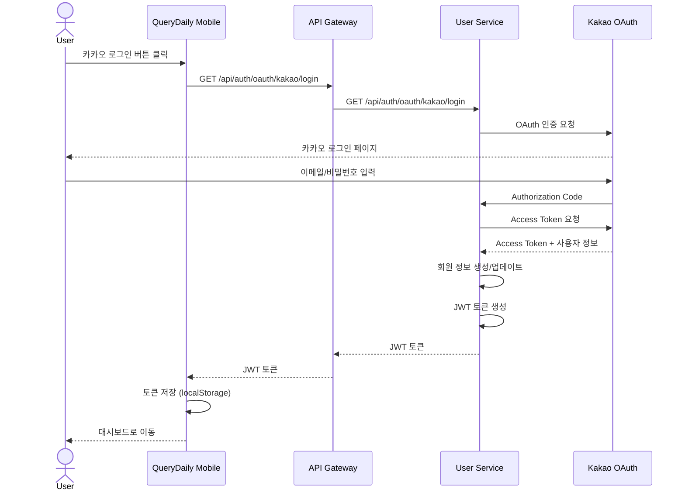
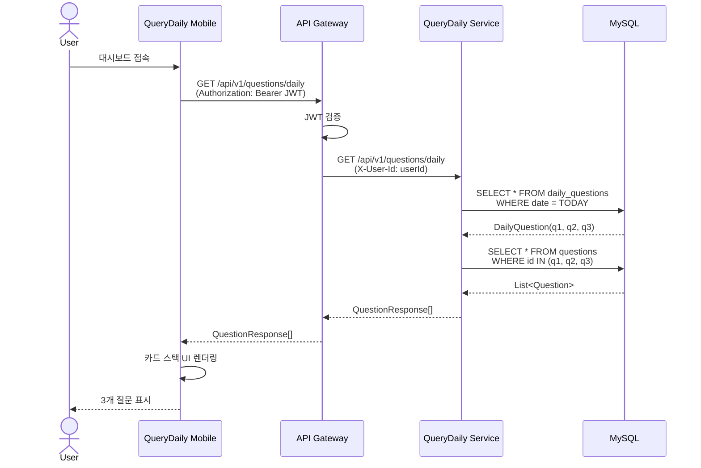
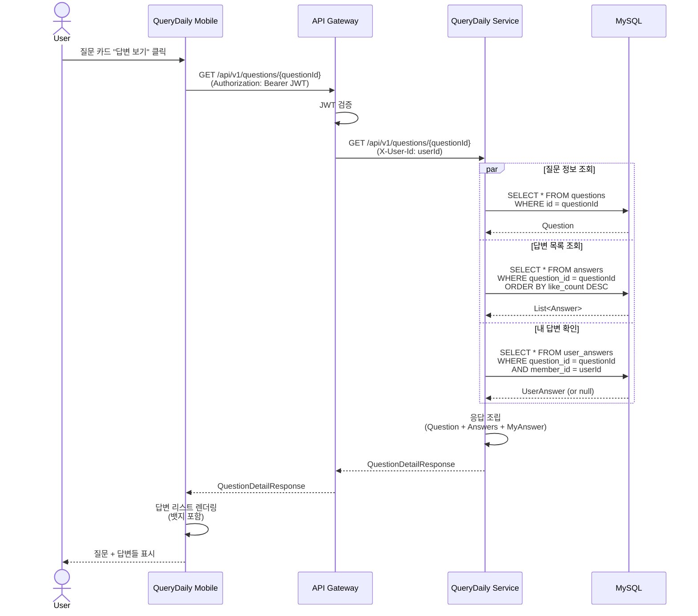
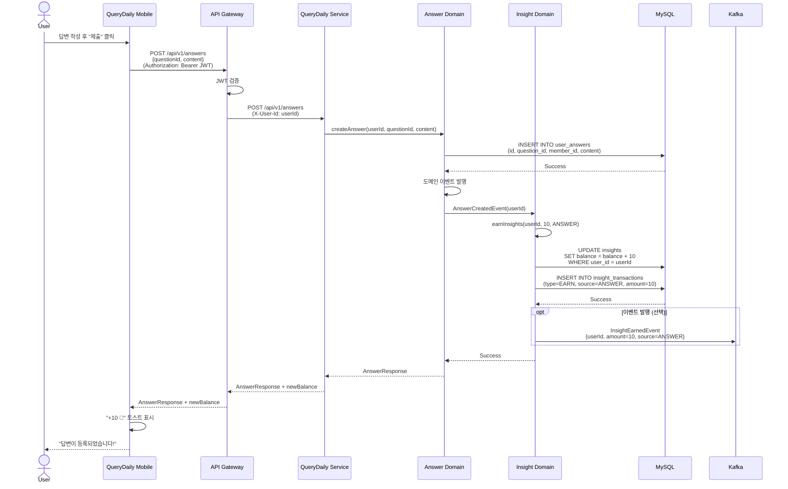
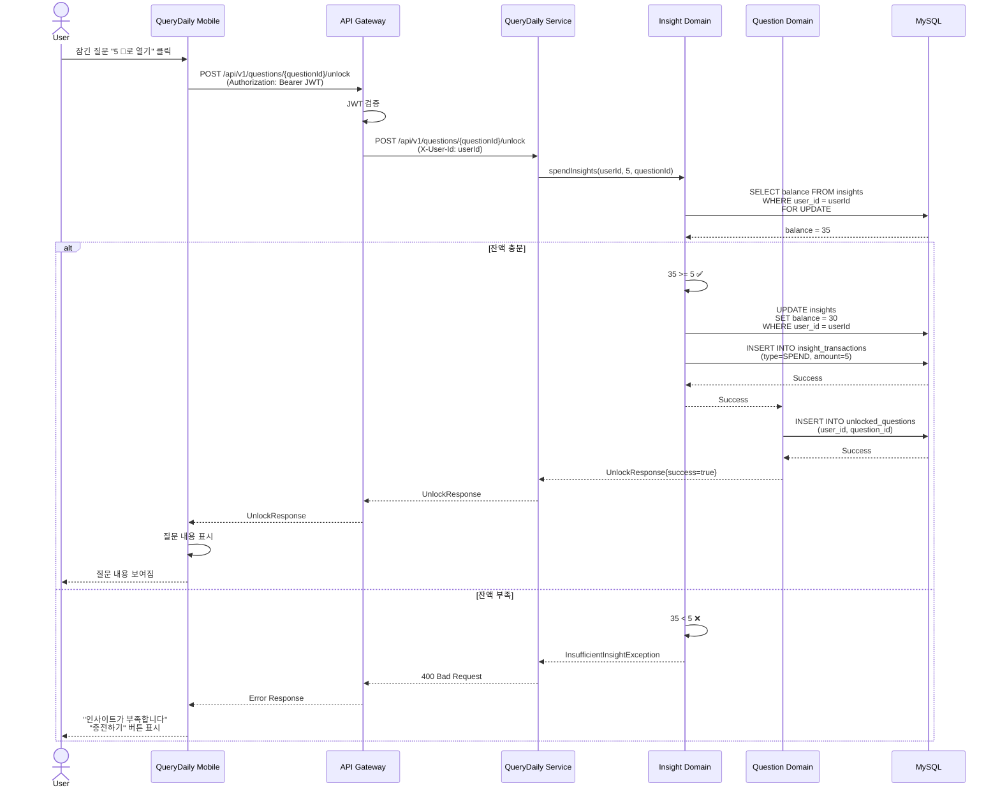
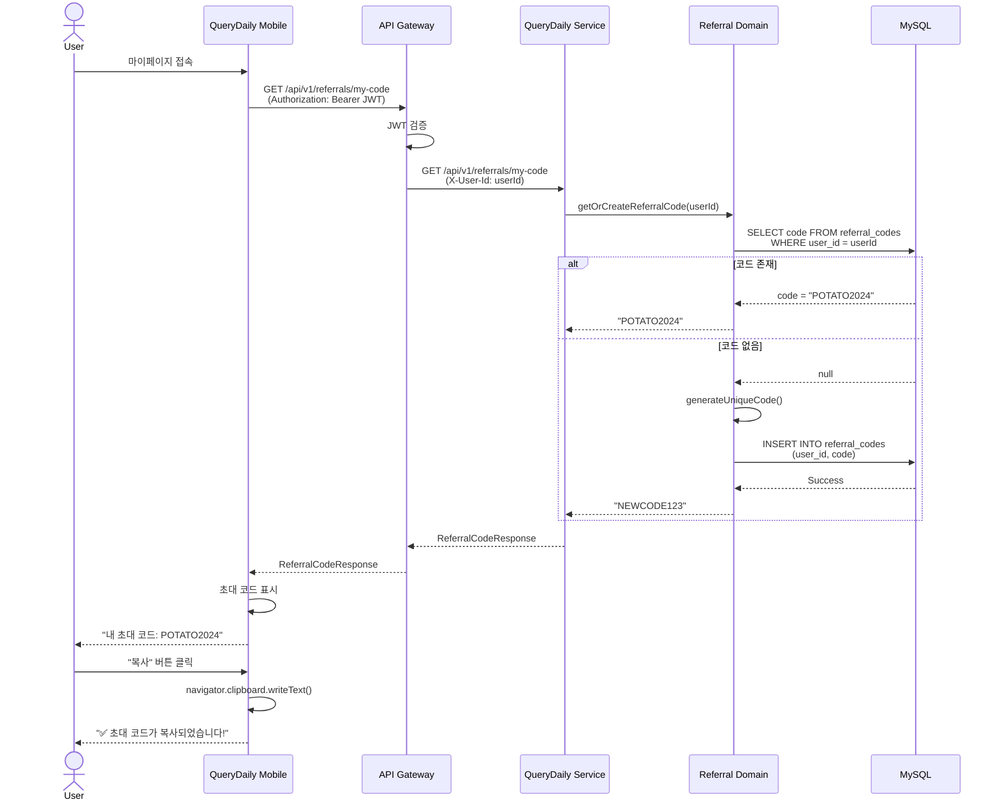
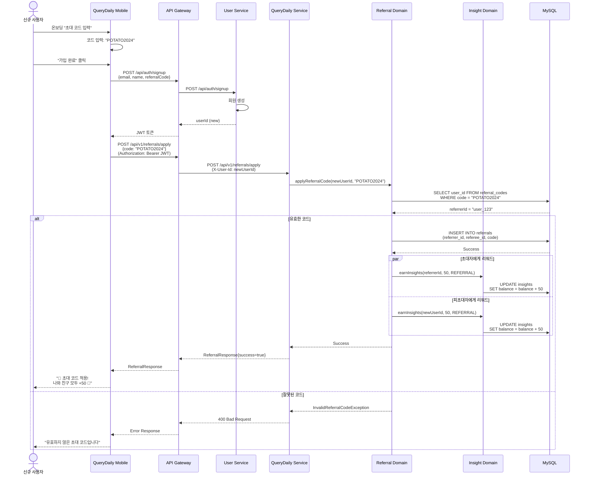
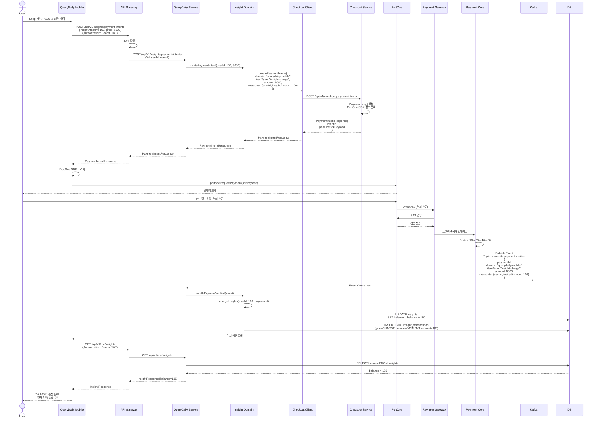

# QueryDaily Mobile MVP - 제품 및 기술 로드맵

**문서 버전**: 1.0
**최종 업데이트**: 2025년 1월 20일
**목표 런칭일**: 11월 중순 (3-4주 후)
**초기 사용자**: 50명 (카카오톡 채팅방 베타)

---

## 1. 요약

### 현재 상황

**기존 자산:**
- `querydaily-frontend/prototype11`: 완성된 UI/UX 웹 프로토타입 (하드코딩된 데이터)
- `query-daily-service`: 이력서 → AI 면접 질문 → 이메일 발송 서비스 (재사용 불가)
- AsyncSite MSA: user-service, noti-service, asset-service, API Gateway

**새로 만들어야 하는 것:**
1. **모바일 우선 PWA 프론트엔드** (새 레포지토리)
2. **새 백엔드 서비스** (querydaily-mobile-service)
3. **AsyncSite MSA 통합** (user-service 인증 연동)

### 핵심 가치 제안

> "다른 사람의 생각을 엿보며 배우는" - 특히 LINE, Kakao, Naver 등 현직자들의 면접 답변을 보며 학습

**핵심 가설**: 개발자는 혼자 공부하는 것보다 다른 사람(특히 좋은 회사 경력자)의 답변을 보면서 더 빠르게 성장한다.

**핵심 지표**: 주간 활성 답변 조회수 (Weekly Active Answer Views)

### 성공 기준

**필수 기능 (MVP):**
- [ ] 카카오 OAuth 로그인
- [ ] 매일 3개 질문 (카드 스택 UI)
- [ ] 다른 사람 답변 보기 (회사/경력/기술스택 뱃지 포함)
- [ ] 내 답변 작성 → 10 💎 획득
- [ ] 5 💎 소비해서 과거 질문 보기
- [ ] 친구 초대 시스템 (+50 💎 양쪽 모두)
- [ ] 인사이트 충전 (PortOne 결제 연동)

**추가 기능 (Phase 2):**
- [ ] 프리미엄 구독 (검색, 회사 필터, 북마크)
- [ ] 회사 인증

**향후 기능:**
- [ ] AI 답변 분석
- [ ] 실시간 협업
- [ ] 스터디 그룹 기능

---

## 2. 핵심 결정 사항

### Decision 0.1: 레포지토리 구조 ✅

**프론트엔드:**
- **새 레포**: `asyncsite/querydaily-mobile`
  - prototype11 코드를 시작점으로 복사
  - Next.js 14 + TypeScript + Tailwind CSS
  - PWA 설정 (manifest + service worker)
  - 모바일 우선 반응형 디자인

**백엔드:**
- **새 레포**: `asyncsite/querydaily-mobile-service`
  - Spring Boot 3.5.3 + Java 21
  - 헥사고날 아키텍처 (user-service와 동일)
  - AsyncSite MSA 통합
  - 포트: 8388

**선택 이유:**
- 기존 query-daily-service와 완전히 다른 비즈니스 모델
- 독립적인 배포 및 확장
- Prototype11이 검증된 UI/UX 기반 제공

### Decision 0.2: 백엔드 도메인 설계 ✅

**핵심 도메인:**

```
querydaily-mobile-service/
└── src/main/java/com/asyncsite/querydailymobile/
    ├── question/          # 질문 도메인
    │   ├── domain/
    │   ├── application/
    │   └── adapter/
    ├── answer/            # 답변 도메인
    │   ├── domain/
    │   ├── application/
    │   └── adapter/
    ├── insight/           # 인사이트 (💎) 도메인
    │   ├── domain/
    │   ├── application/
    │   └── adapter/
    ├── referral/          # 친구 초대 도메인
    │   ├── domain/
    │   ├── application/
    │   └── adapter/
    ├── subscription/      # 프리미엄 구독 도메인
    │   ├── domain/
    │   ├── application/
    │   └── adapter/
    └── member/            # 회원 프로필 (읽기 전용 캐시)
        ├── domain/
        ├── application/
        └── adapter/
```

**도메인 책임:**

| 도메인 | 책임 | 주요 엔티티 |
|--------|------|-------------|
| `question` | 질문 관리, 일일 로테이션 | Question, DailyQuestions, QuestionCategory |
| `answer` | 답변 CRUD, 뱃지 시스템 | Answer, UserAnswer, AnswerBadge |
| `insight` | 가상 화폐 관리 | InsightBalance, InsightTransaction |
| `referral` | 친구 초대 시스템 | Referral, InviteCode, ReferralReward |
| `subscription` | 프리미엄 플랜 관리 | Subscription, SubscriptionPlan |
| `member` | 사용자 프로필 캐시 (user-service 동기화) | MemberProfile |

### Decision 0.3: AsyncSite 통합 계정 시스템 ✅

**핵심 개념: QueryDaily는 AsyncSite 플랫폼의 한 서비스**

사용자는 **AsyncSite 통합 계정** 하나로 모든 서비스(Study, QueryDaily, 기타)를 이용합니다.

```
AsyncSite 플랫폼
├─ user-service (통합 인증 & 계정 관리)
├─ study-service (스터디 관리)
├─ querydaily-mobile-service (면접 질문 학습) ← 신규
└─ 기타 서비스들...
```

**계정 구조:**

| 계층 | 관리 주체 | 데이터 |
|------|----------|--------|
| **통합 계정** | user-service | 이메일, 이름, 프로필 이미지, 카카오 연동 |
| **서비스 전용 데이터** | 각 서비스 | QueryDaily: 인사이트 잔액, 구독 상태<br>Study: 스터디 참여 내역 |

**user-service가 제공하는 것:**
- 카카오 OAuth 로그인 (AsyncSite 통합 계정)
- JWT 토큰 발급 (모든 서비스에서 사용 가능)
- 기본 사용자 정보 (이메일, 이름, 프로필 이미지)
- SSO (Single Sign-On) - 한 번 로그인하면 모든 서비스 이용 가능

**querydaily-mobile-service가 관리하는 것:**
- 인사이트 잔액 (💎)
- 프리미엄 구독 상태
- 질문 & 답변
- 초대 코드 및 리워드

**통합 패턴:**

1. **인증 플로우 (API Gateway 필수):**
   ```
   로그인 시:
   모바일 앱 → API Gateway → user-service: 카카오 OAuth 로그인
   user-service → API Gateway → 모바일 앱: JWT 토큰
   모바일 앱: JWT를 localStorage에 저장

   일반 API 호출 시:
   모바일 앱 → API Gateway: JWT 포함
   API Gateway: JWT 검증 (공통)
   API Gateway → querydaily-mobile-service: userId 헤더 추가
   querydaily-mobile-service: userId 신뢰 (재검증 안 함)
   ```

2. **API Gateway 라우팅:**
   ```
   /api/auth/**        → user-service (JWT 검증 제외)
   /api/users/**       → user-service (JWT 검증 필요)
   /api/v1/questions/** → querydaily-mobile-service (JWT 검증 필요)
   /api/v1/answers/**  → querydaily-mobile-service (JWT 검증 필요)
   /api/v1/insights/** → querydaily-mobile-service (JWT 검증 필요)
   기타 모든 /api/v1/** → querydaily-mobile-service
   ```

3. **프로필 동기화 (Kafka 이벤트):**
   ```
   user-service → Kafka: user.profile.updated 이벤트
   querydaily-mobile-service → Kafka: 이벤트 구독
   querydaily-mobile-service: member 테이블 업데이트 (읽기 전용 캐시)
   ```

4. **데이터 소유권:**
   - user-service DB: `users` 테이블 (Single Source of Truth)
   - querydaily-mobile-service DB: `members` 테이블 (캐시된 프로필)
   - 동기화 전략: Kafka를 통한 최종 일관성

**사용자 경험:**

1. **신규 사용자:**
   ```
   QueryDaily 앱 설치 → 카카오 로그인 → AsyncSite 계정 생성
   → QueryDaily 온보딩 (초대 코드 입력 가능)
   → QueryDaily 서비스 이용 시작
   ```

2. **기존 AsyncSite 사용자 (예: Study 이용 중):**
   ```
   QueryDaily 앱 설치 → 기존 JWT 재사용 (재로그인 불필요)
   → QueryDaily 첫 방문 감지
   → "AsyncSite 회원이시네요!" 메시지
   → QueryDaily 온보딩 (초대 코드 입력 가능)
   → QueryDaily 서비스 이용 시작
   ```

3. **서비스 간 이동:**
   ```
   QueryDaily에서 로그인 → Study로 이동 → 재로그인 불필요 (SSO)
   Study에서 로그인 → QueryDaily로 이동 → 재로그인 불필요 (SSO)
   ```

4. **회원 탈퇴:**
   ```
   user-service에서 탈퇴
   → 모든 AsyncSite 서비스 데이터 삭제
   → QueryDaily, Study 등 모든 서비스 접근 불가
   ```

**QueryDaily 회원가입 시점:**
- AsyncSite 계정 생성 시점: user-service 가입 시
- QueryDaily 회원가입 시점: **QueryDaily 첫 방문 & 온보딩 완료 시**
  - 초대 코드 입력 가능 (이 시점에만)
  - member 테이블에 레코드 생성
  - 초대 코드 자동 생성
  - 인사이트 초기 잔액 설정 (0 💎 또는 초대 보너스 50 💎)

### Decision 0.4: 초기 컨텐츠 전략 ✅

**100개 질문 시드 데이터:**

| 카테고리 | 개수 | 난이도 분포 |
|----------|------|-------------|
| Spring/Java 백엔드 | 30 | 초급: 10, 중급: 15, 고급: 5 |
| JPA/데이터베이스 | 20 | 초급: 8, 중급: 10, 고급: 2 |
| 네트워크/HTTP | 15 | 초급: 6, 중급: 7, 고급: 2 |
| React/프론트엔드 | 20 | 초급: 8, 중급: 10, 고급: 2 |
| 시스템 디자인 | 15 | 초급: 3, 중급: 8, 고급: 4 |

**출처:**
- 백엔드 딥다이브 아티클
- LeetCode 면접 질문
- 팀의 실제 면접 경험

**300개 시드 답변:**
- 10명이 각각 30개씩 작성
- 뱃지 분포:
  - 회사: LINE (50), Kakao (50), Naver (50), Coupang (50), 기타 (100)
  - 경력: 주니어 (100), 미들 (150), 시니어 (50)
  - 기술스택: Spring, React, JPA, AWS 등 혼합

**뱃지 데이터 (초기):**
- 텍스트 기반 뱃지 (인증 없음)
- 회사 인증 → Phase 2

### Decision 0.4.5: 결제 통합 (PortOne SDK) ✅

**핵심 결정: 런칭 전 인사이트 충전 기능 포함**

QueryDaily Mobile MVP에 PortOne 결제 시스템을 통합하여 사용자가 인사이트를 충전할 수 있도록 합니다.

**통합 범위:**
- ✅ **인사이트 충전** (Phase 1 - MVP 포함)
- ❌ **프리미엄 구독** (Phase 2 - 런칭 후 추가)

**기술적 준비 상태:**
| 컴포넌트 | 상태 | 비고 |
|----------|------|------|
| Payment Core | ✅ 준비 완료 | Transaction 관리, 상태 머신, S2S 검증 |
| Checkout Service | ✅ 준비 완료 | PaymentIntent 관리, 멱등성 보장 |
| Payment Gateway | ✅ 준비 완료 | PortOne V2 통합, Mock Server 완비 |
| PortOne SDK | ✅ 사용 가능 | `@portone/browser-sdk` 패키지 |
| API Gateway 라우팅 | ⚠️ 설정 필요 | `/api/v1/payments/**` → checkout-service |

**결제 플로우 (PortOne SDK 방식):**

```
1. 사용자: 인사이트 충전 버튼 클릭 (shop 페이지)
   ↓
2. 프론트엔드 → Checkout Service
   POST /api/v1/checkout/payment-intents
   {
     domain: "querydaily-mobile",
     itemType: "insight-charge",
     amount: { final: 10000 },
     customer: { email, name },
     metadata: { insightAmount: 100 }
   }
   ↓
3. Checkout Service 응답
   {
     intentId: "intent_xxx",
     invocationType: "SDK",
     portOneSdkPayload: {
       storeId: "store-xxx",
       channelKey: "channel-xxx",
       paymentId: "intent_xxx",
       orderName: "인사이트 100 💎",
       totalAmount: 10000,
       payMethod: "CARD"
     }
   }
   ↓
4. 프론트엔드: PortOne SDK 호출
   const portone = PortOne(storeId);
   await portone.requestPayment(portOneSdkPayload);
   → 결제창 열림 (시스템 브라우저 또는 인앱 WebView)
   ↓
5. 사용자: 결제 승인 (카드/카카오페이/네이버페이)
   ↓
6. PG사 → Payment Gateway → Payment Core (S2S Webhook)
   → Transaction 상태: CONFIRMED
   → Kafka 이벤트 발행: asyncsite.payment.verified
   ↓
7. querydaily-mobile-service: Kafka Listener
   → 인사이트 충전 (insight 도메인)
   → InsightTransaction 생성
   → InsightBalance 업데이트 (+100 💎)
   ↓
8. 프론트엔드: 상태 폴링 (Smart Retry)
   GET /api/v1/checkout/payment-intents/{intentId}/status
   → status: CONFIRMED 확인
   → 충전 완료 UI 표시
```

**PWA 환경에서의 PortOne SDK 동작:**
- ✅ **시스템 브라우저 방식**: `window.open()` 또는 SDK 자체 팝업
- ✅ **인앱 WebView**: PWA 설치 후에도 결제창 정상 동작
- ✅ **콜백 처리**: Webhook 기반 (프론트엔드는 폴링으로 상태 확인)
- ⚠️ **딥링크 불필요**: Redirect URL이 아닌 SDK 방식이므로 딥링크 설정 불필요

**인사이트 충전 상품:**
| 상품명 | 인사이트 | 가격 | 보너스 |
|--------|----------|------|--------|
| 미니 | 50 💎 | ₩3,000 | - |
| 베이직 | 100 💎 | ₩5,000 | +10 💎 |
| 프리미엄 | 300 💎 | ₩13,000 | +50 💎 |

**백엔드 작업 (querydaily-mobile-service):**
- [ ] payment 도메인 생성:
  - PaymentEventListener (Kafka)
  - InsightChargeHandler
- [ ] insight 도메인에 충전 로직 추가:
  - ChargeInsightUseCase
  - InsightTransaction 엔티티
- [ ] Kafka 설정:
  - 토픽: `asyncsite.payment.verified`
  - Consumer Group: `querydaily-mobile-payment-consumer`

**프론트엔드 작업 (querydaily-mobile PWA):**
- [ ] PortOne SDK 설치:
  ```bash
  npm install @portone/browser-sdk
  ```
- [ ] 인사이트 충전 페이지 구현:
  - shop 페이지에 충전 상품 카드
  - 충전 버튼 → Checkout API 호출
  - SDK payload 수신 → PortOne SDK 실행
- [ ] 결제 상태 폴링:
  - Exponential Backoff (0s → 1s → 2s → 5s)
  - 최대 30초 폴링
  - 타임아웃 시 에러 처리
- [ ] 충전 완료 UI:
  - Toast 알림
  - 인사이트 잔액 실시간 업데이트

**API Gateway 라우팅 설정:**
```yaml
/api/v1/checkout/payment-intents/** → asyncsite-checkout-service:6081
/api/v1/checkout/webhooks/** → asyncsite-checkout-service:6081
```

**추가 개발 기간:**
- 백엔드: 3일 (payment 도메인 + Kafka listener)
- 프론트엔드: 4일 (SDK 통합 + 충전 UI)
- 테스트: 2일 (E2E 결제 플로우)
- **총 1-1.5주 추가**

**프리미엄 구독 (Phase 2 - 런칭 후 추가):**
- 월간 구독: ₩9,900/월
- 기능: 검색, 회사 필터, 북마크, 매일 +20 💎
- 구현 시점: MVP 런칭 후 2-3주 내

---

### Decision 0.4.6: 실시간 채용공고 알림 시스템 (보류 🔄)

**핵심 결정: MVP에서 제외, 향후 재고려**

**기능 개요:**
QueryDaily 사용자에게 LINE, Kakao, Naver, 쿠팡, 토스, 우아한형제들, 당근 등 주요 IT 기업의 신규 채용공고를 실시간으로 알림.

**기술적 준비 상태:**
| 컴포넌트 | 상태 | 비고 |
|----------|------|------|
| job-crawler-service | ✅ 운영 중 | 7개 주요 IT 기업 크롤링 (Python FastAPI) |
| job-navigator-service | ✅ 운영 중 | 채용공고 조회 API 제공 (Java Spring Boot) |
| Discord 알림 | ✅ 구현됨 | 신규 공고 Discord 웹훅 발송 |
| 크롤링 인프라 | ✅ 완성 | Selenium + Greenhouse API |

**보류 이유 (비즈니스 분석 결과):**

**1. 제품 포커스 상실 위험 (Critical)**
```
QueryDaily 핵심 가치 = "면접 학습 플랫폼"
채용공고 알림 = "채용 정보 플랫폼"
→ 완전히 다른 비즈니스 영역
```

**2. MVP 가설 검증과 무관**
- 검증할 핵심 가설: "사용자가 다른 사람의 면접 답변을 보며 학습하고 싶어하는가?"
- 채용공고 알림: 이 가설 검증과 직접 연관 없음
- MVP는 **한 가지만 극도로 잘해야 함**

**3. 리소스 효율성**
- 예상 개발 기간: 3-4일 (알림 시스템 구축)
- 동일 시간에 **핵심 기능 완성도** 높이는 게 우선
  - 질문 품질 개선
  - 답변 UI/UX 강화
  - 인사이트 이코노미 정교화

**4. 경쟁 포화 시장**
- 이미 존재: 원티드, 로켓펀치, 점핏, 링크드인, 잡코리아
- 채용공고만으로는 차별화 어려움
- QueryDaily의 고유 가치에 집중 필요

**재고려 조건 (Phase 2 이후):**

**필수 조건 (모두 충족 시 검토):**
1. ✅ **MVP 핵심 가설 검증 완료**
   - 주간 활성 답변 조회수 목표 달성
   - 사용자 리텐션 30% 이상
2. ✅ **사용자 명시적 니즈 확인**
   - 설문 조사: "채용공고 알림 원하시나요?"
   - 50% 이상 긍정 응답
3. ✅ **핵심 기능 완성도 확보**
   - 답변 품질 만족도 4.0/5.0 이상
   - 인사이트 이코노미 정상 작동

**차별화 전략 (추가 시 필수):**

**❌ 절대 하지 말 것:**
```
단순 채용공고 알림
"카카오 백엔드 개발자 채용공고가 올라왔습니다."
→ 다른 앱과 동일, 차별화 없음
```

**✅ QueryDaily만의 방식:**
```
학습과 연계된 알림
"🆕 [카카오] 백엔드 개발자 공고 등록!
 📚 카카오 현직자 면접 답변 5개 먼저 보기 (10 💎)
 🎯 카카오 면접 준비 완료 후 지원하세요"
```

**구현 시 고려사항 (향후):**

**Option A: 간단 통합 (추천)**
```
job-crawler-service 신규 공고 감지
  ↓
querydaily-mobile-service POST /api/v1/notifications
  ↓
notification 도메인 저장
  ↓
프론트엔드 폴링으로 알림 표시
```
- 개발 기간: 3-4일
- 장점: 빠른 구현, 기존 인프라 재사용
- 단점: 실시간성 제한

**Option B: Kafka 이벤트 기반**
```
job-crawler-service
  ↓
Kafka Topic: asyncsite.job.posted
  ↓
querydaily-mobile-service (Kafka Listener)
  ↓
noti-service 푸시 알림 (FCM/APNs)
```
- 개발 기간: 1주
- 장점: 진짜 푸시 알림, 확장성 좋음
- 단점: 복잡도 증가

**맞춤형 알림 (Phase 3):**
- 사용자별 관심 기술 스택 설정 (Spring, React, AWS 등)
- 관심 회사 설정 (카카오, 네이버만 알림)
- 경력 레벨 필터링 (주니어/시니어)

**예상 개발 기간 (재고려 시):**
- Phase 2 (앱 내 알림): 3-4일
- Phase 3 (푸시 알림): 추가 3-4일
- Phase 4 (맞춤형): 추가 1주

**의사결정 기록:**
- 결정일: 2025년 1월 20일
- 결정자: 제품 팀
- 재검토 예정: MVP 런칭 후 4주 (2025년 2월 중순)

---

### Decision 0.5: 배포 전략 ✅

**프론트엔드 (PWA):**
- **플랫폼**: Vercel
- **기술**: Next.js 14 + PWA (next-pwa)
- **기능**:
  - 오프라인 지원 (service worker)
  - 홈 화면에 추가
  - 푸시 알림 (향후)
- **환경**: 프로덕션만 (MVP는 스테이징 없음)

**백엔드 (마이크로서비스):**
- **플랫폼**: 기존 AsyncSite 인프라
- **컨테이너**: Docker + docker-compose
- **네트워크**: asyncsite-network
- **서비스 디스커버리**: Eureka
- **데이터베이스**: MySQL 8.0 (공유 asyncsite-mysql)
- **캐시**: Redis 7 (공유 asyncsite-redis)
- **메시지 큐**: Kafka (user-service 동기화용)

**데이터베이스 이름**: `querydailymobiledb`

---

## 3. 기술 아키텍처

### 3.1 시스템 개요

```
┌─────────────────────────────────────────────────────────────┐
│                  클라이언트 계층 (PWA)                        │
│               querydaily-mobile (Vercel)                     │
└───────────────────────────┬─────────────────────────────────┘
                            │ HTTPS
                            ▼
┌─────────────────────────────────────────────────────────────┐
│                API Gateway (향후) 또는 직접 접근              │
└──────────┬──────────────────────────────────┬───────────────┘
           │                                  │
           ▼                                  ▼
┌──────────────────────┐          ┌──────────────────────┐
│   user-service       │          │ querydaily-mobile-   │
│   (기존)             │◄────────►│    service (신규)    │
│ - 카카오 OAuth       │  Kafka   │ - 질문               │
│ - JWT 토큰           │  이벤트  │ - 답변               │
│ - 사용자 프로필      │          │ - 인사이트 (💎)      │
└──────────┬───────────┘          │ - 초대               │
           │                      │ - 구독               │
           │                      └──────────┬───────────┘
           │                                 │
           ▼                                 ▼
┌─────────────────────────────────────────────────────────────┐
│                        데이터 계층                            │
│  MySQL (users, members) | Redis (캐시) | Kafka (이벤트)     │
└─────────────────────────────────────────────────────────────┘
```

### 3.2 API 설계

**기본 URL:**
- user-service: `http://localhost:8081` (기존)
- querydaily-mobile-service: `http://localhost:8388` (신규)

**핵심 엔드포인트:**

```
인증 (user-service)
├─ POST   /api/auth/oauth/kakao       # 카카오 로그인
├─ POST   /api/auth/refresh           # 토큰 갱신
└─ GET    /api/users/me               # 현재 사용자 정보

질문 (querydaily-mobile-service)
├─ GET    /api/v1/questions/daily     # 오늘의 3문제
├─ GET    /api/v1/questions/{id}      # 질문 상세
├─ GET    /api/v1/questions/archive   # 과거 질문 (5 💎 소비)
└─ GET    /api/v1/categories          # 질문 카테고리

답변 (querydaily-mobile-service)
├─ GET    /api/v1/questions/{id}/answers   # 답변 목록 (뱃지 포함)
├─ POST   /api/v1/answers                  # 답변 작성 (+10 💎)
├─ GET    /api/v1/me/answers               # 내 답변
└─ DELETE /api/v1/answers/{id}             # 내 답변 삭제

인사이트 (querydaily-mobile-service)
├─ GET    /api/v1/me/insights              # 내 잔액
├─ GET    /api/v1/me/insights/transactions # 거래 내역
└─ POST   /api/v1/insights/purchase        # 인사이트 구매 (테스트 모드)

초대 (querydaily-mobile-service)
├─ GET    /api/v1/me/referral/code         # 내 초대 코드
├─ POST   /api/v1/referrals/claim          # 초대 코드 입력 (+50 💎 양쪽)
└─ GET    /api/v1/me/referrals/stats       # 초대 통계

구독 (querydaily-mobile-service)
├─ GET    /api/v1/me/subscription          # 내 구독 상태
└─ POST   /api/v1/subscriptions            # 프리미엄 구독
```

### 3.3 데이터베이스 스키마 (주요 테이블)

```sql
-- 질문
CREATE TABLE questions (
    id VARCHAR(36) PRIMARY KEY,
    title VARCHAR(500) NOT NULL,
    content TEXT NOT NULL,
    category VARCHAR(50) NOT NULL,
    difficulty VARCHAR(20) NOT NULL,
    answer_count INT DEFAULT 0,
    created_at TIMESTAMP DEFAULT CURRENT_TIMESTAMP,
    INDEX idx_category (category),
    INDEX idx_difficulty (difficulty)
);

-- 일일 질문 로테이션
CREATE TABLE daily_questions (
    id BIGINT AUTO_INCREMENT PRIMARY KEY,
    date DATE NOT NULL UNIQUE,
    question_1_id VARCHAR(36) NOT NULL,
    question_2_id VARCHAR(36) NOT NULL,
    question_3_id VARCHAR(36) NOT NULL,
    FOREIGN KEY (question_1_id) REFERENCES questions(id),
    FOREIGN KEY (question_2_id) REFERENCES questions(id),
    FOREIGN KEY (question_3_id) REFERENCES questions(id)
);

-- 답변 (경력자 답변)
CREATE TABLE answers (
    id VARCHAR(36) PRIMARY KEY,
    question_id VARCHAR(36) NOT NULL,
    member_id VARCHAR(36) NOT NULL,
    content TEXT NOT NULL,
    company_badge VARCHAR(100),      -- LINE, Kakao, Naver 등
    experience_badge VARCHAR(50),    -- 주니어, 미들, 시니어
    tech_badges JSON,                -- ["Spring", "JPA", "AWS"]
    view_count INT DEFAULT 0,
    created_at TIMESTAMP DEFAULT CURRENT_TIMESTAMP,
    FOREIGN KEY (question_id) REFERENCES questions(id),
    INDEX idx_question (question_id),
    INDEX idx_member (member_id)
);

-- 사용자 답변
CREATE TABLE user_answers (
    id VARCHAR(36) PRIMARY KEY,
    question_id VARCHAR(36) NOT NULL,
    member_id VARCHAR(36) NOT NULL,
    content TEXT NOT NULL,
    is_public BOOLEAN DEFAULT FALSE,
    created_at TIMESTAMP DEFAULT CURRENT_TIMESTAMP,
    FOREIGN KEY (question_id) REFERENCES questions(id),
    INDEX idx_member_question (member_id, question_id)
);

-- 인사이트 잔액
CREATE TABLE insight_balances (
    member_id VARCHAR(36) PRIMARY KEY,
    balance INT DEFAULT 0,
    updated_at TIMESTAMP DEFAULT CURRENT_TIMESTAMP ON UPDATE CURRENT_TIMESTAMP
);

-- 인사이트 거래
CREATE TABLE insight_transactions (
    id VARCHAR(36) PRIMARY KEY,
    member_id VARCHAR(36) NOT NULL,
    amount INT NOT NULL,              -- 획득은 양수, 소비는 음수
    type VARCHAR(20) NOT NULL,        -- EARN, SPEND
    reason VARCHAR(100) NOT NULL,     -- ANSWER_WRITE, VIEW_ARCHIVE, REFERRAL, PURCHASE
    reference_id VARCHAR(36),         -- 관련 엔티티 ID (answer_id, question_id 등)
    created_at TIMESTAMP DEFAULT CURRENT_TIMESTAMP,
    FOREIGN KEY (member_id) REFERENCES members(id),
    INDEX idx_member_created (member_id, created_at DESC)
);

-- 초대
CREATE TABLE referrals (
    id VARCHAR(36) PRIMARY KEY,
    referrer_id VARCHAR(36) NOT NULL,
    referred_id VARCHAR(36) NOT NULL,
    code VARCHAR(20) NOT NULL,
    status VARCHAR(20) DEFAULT 'COMPLETED',
    claimed_at TIMESTAMP DEFAULT CURRENT_TIMESTAMP,
    FOREIGN KEY (referrer_id) REFERENCES members(id),
    FOREIGN KEY (referred_id) REFERENCES members(id),
    UNIQUE KEY uk_referred (referred_id),
    INDEX idx_referrer (referrer_id)
);

-- 초대 코드
CREATE TABLE invite_codes (
    member_id VARCHAR(36) PRIMARY KEY,
    code VARCHAR(20) UNIQUE NOT NULL,
    referral_count INT DEFAULT 0,
    created_at TIMESTAMP DEFAULT CURRENT_TIMESTAMP,
    FOREIGN KEY (member_id) REFERENCES members(id)
);

-- 구독
CREATE TABLE subscriptions (
    id VARCHAR(36) PRIMARY KEY,
    member_id VARCHAR(36) NOT NULL,
    plan VARCHAR(20) NOT NULL,         -- PREMIUM
    status VARCHAR(20) NOT NULL,       -- ACTIVE, EXPIRED, CANCELLED
    start_date DATE NOT NULL,
    end_date DATE NOT NULL,
    created_at TIMESTAMP DEFAULT CURRENT_TIMESTAMP,
    FOREIGN KEY (member_id) REFERENCES members(id),
    INDEX idx_member_status (member_id, status)
);

-- 회원 (user-service에서 캐시)
CREATE TABLE members (
    id VARCHAR(36) PRIMARY KEY,        -- user-service의 user ID와 동일
    email VARCHAR(255) NOT NULL,
    name VARCHAR(100),
    profile_image VARCHAR(500),
    company VARCHAR(100),
    role VARCHAR(100),
    synced_at TIMESTAMP DEFAULT CURRENT_TIMESTAMP ON UPDATE CURRENT_TIMESTAMP,
    UNIQUE KEY uk_email (email)
);
```

---

## 4. 주차별 구현 계획

### 1주차: 기반 구축 (1-7일차)

**목표**: 로그인 → 오늘의 3문제 보기

**백엔드 작업:**
- [x] 레포지토리 생성: querydaily-mobile-service
- [ ] 프로젝트 구조 설정 (헥사고날 아키텍처)
- [ ] 의존성 설정 (Spring Boot, MySQL, Redis, Kafka)
- [ ] JWT 검증 구현 (user-service와 secret 공유)
- [ ] 회원 동기화 구현 (Kafka listener for user.profile.updated)
- [ ] question 도메인 생성:
  - [ ] 도메인 모델: Question, DailyQuestions
  - [ ] 유스케이스: GetDailyQuestionsUseCase, GetQuestionDetailUseCase
  - [ ] Persistence 어댑터: QuestionJpaEntity, QuestionJpaRepository
  - [ ] Web 어댑터: QuestionController
- [ ] 100개 질문 시드 데이터 삽입
- [ ] 30일치 daily_questions 엔트리 생성
- [ ] 질문 API 통합 테스트 작성

**프론트엔드 작업:**
- [x] 레포지토리 생성: querydaily-mobile
- [ ] prototype11 코드 베이스라인으로 복사
- [ ] PWA 의존성 설치 및 설정 (next-pwa)
- [ ] manifest.json 생성 (아이콘, 테마 색상, start_url)
- [ ] 오프라인 지원용 service worker 설정
- [ ] 환경 변수 설정 (NEXT_PUBLIC_API_URL)
- [ ] API 클라이언트 구현 (lib/api.ts)
- [ ] dashboard를 GET /api/v1/questions/daily에 연결
- [ ] 질문 상세를 GET /api/v1/questions/{id}에 연결
- [ ] 로딩 상태 및 에러 처리 추가
- [ ] 모바일 기기에서 PWA 설치 테스트

**인프라 작업:**
- [ ] docker-compose에 querydaily-mobile-service 추가
- [ ] querydailymobiledb 데이터베이스 생성
- [ ] Kafka 토픽 설정: user.profile.updated
- [ ] Eureka 서비스 등록 설정
- [ ] JWT 토큰 플로우 end-to-end 검증

**완료 기준:**
- [ ] 사용자가 카카오로 로그인 가능 (user-service 통해)
- [ ] Dashboard에 데이터베이스의 실제 3문제 표시
- [ ] 질문 상세 페이지에 질문 내용 표시
- [ ] PWA를 모바일에 설치 가능 (홈 화면에 추가)

---

### 2주차: 핵심 루프 (8-14일차)

**목표**: 답변 작성 → 10 💎 획득 → 과거 질문 보기

**백엔드 작업:**
- [ ] answer 도메인 생성:
  - [ ] 도메인 모델: Answer, UserAnswer, AnswerBadge
  - [ ] 유스케이스: GetAnswerListUseCase, CreateAnswerUseCase
  - [ ] Persistence 어댑터
  - [ ] Web 어댑터
- [ ] 뱃지 데이터 포함 300개 답변 시드
- [ ] insight 도메인 생성:
  - [ ] 도메인 모델: InsightBalance, InsightTransaction
  - [ ] 유스케이스: GetBalanceUseCase, EarnInsightUseCase, SpendInsightUseCase
  - [ ] Persistence 어댑터
  - [ ] Web 어댑터
- [ ] 비즈니스 로직 구현:
  - [ ] CreateAnswerService: 답변 생성 + 10 💎 획득 (트랜잭션)
  - [ ] ViewArchiveService: 5 💎 소비 + 과거 질문 반환
  - [ ] 잔액 확인: 인사이트 부족 시 에러 반환
- [ ] answer + insight 플로우 통합 테스트 작성

**프론트엔드 작업:**
- [ ] 질문 상세를 GET /api/v1/questions/{id}/answers에 연결
- [ ] 뱃지(회사, 경력, 기술) 포함 답변 리스트 표시
- [ ] 답변 작성 UI 구현 (POST /api/v1/answers에 연결)
- [ ] 답변 생성 시 성공 토스트 표시
- [ ] mypage를 GET /api/v1/me/insights에 연결
- [ ] 헤더에 실시간 인사이트 잔액 표시
- [ ] archive 페이지를 GET /api/v1/questions/archive에 연결
- [ ] 잔액 부족 시 paywall 모달 구현
- [ ] 더 나은 UX를 위한 낙관적 UI 업데이트 추가

**완료 기준:**
- [ ] 사용자가 질문 상세 페이지에서 뱃지 포함 답변 확인
- [ ] 사용자가 답변 작성하고 즉시 +10 💎 확인
- [ ] Archive 페이지에서 과거 질문 표시 (5 💎 소비)
- [ ] 잔액 < 5 💎일 때 paywall 모달 표시
- [ ] 모든 페이지에서 잔액 실시간 업데이트

---

### 3주차: 수익화 및 결제 통합 (15-21일차)

**목표**: 친구 초대 (+50 💎 양쪽) + 인사이트 충전 (PortOne) + 상점 통합

**백엔드 작업:**
- [ ] referral 도메인 생성:
  - [ ] 도메인 모델: Referral, InviteCode, ReferralReward
  - [ ] 유스케이스: GetMyCodeUseCase, ClaimReferralUseCase, GetStatsUseCase
  - [ ] Persistence 어댑터
  - [ ] Web 어댑터
- [ ] 초대 로직 구현:
  - [ ] 회원가입 시 초대 코드 자동 생성 (user-service 이벤트 훅)
  - [ ] 초대 코드 고유성 검증
  - [ ] ClaimReferralService: 초대자 + 피초대자 +50 💎 (트랜잭션)
  - [ ] 중복 클레임 방지 (사용자당 1회만)
- [ ] **payment 도메인 생성 (결제 통합)**:
  - [ ] PaymentEventListener (Kafka)
  - [ ] InsightChargeHandler
  - [ ] 토픽: `asyncsite.payment.verified`
  - [ ] Consumer Group: `querydaily-mobile-payment-consumer`
- [ ] **insight 도메인 확장 (충전 기능)**:
  - [ ] ChargeInsightUseCase
  - [ ] InsightTransaction 엔티티 (payment_intent_id 포함)
  - [ ] 충전 상품 정의 (50/100/300 💎)
- [ ] referral + payment 통합 테스트 작성

**프론트엔드 작업:**
- [ ] dashboard 초대 모달을 GET /api/v1/me/referral/code에 연결
- [ ] 초대 코드 클립보드 복사 구현
- [ ] 회원가입 플로우 추가: 초대 코드 입력 → POST /api/v1/referrals/claim
- [ ] mypage 초대 섹션을 GET /api/v1/me/referrals/stats에 연결
- [ ] 실제 초대 통계 표시 (초대한 친구, 획득한 인사이트)
- [ ] **PortOne SDK 설치 및 설정**:
  - [ ] `npm install @portone/browser-sdk`
  - [ ] 환경 변수 추가: `NEXT_PUBLIC_PORTONE_STORE_ID`
- [ ] **shop 페이지 결제 통합**:
  - [ ] 충전 상품 카드 (50/100/300 💎)
  - [ ] 충전 버튼 → POST /api/v1/checkout/payment-intents
  - [ ] portOneSdkPayload 수신 → PortOne SDK 실행
  - [ ] 결제창 팝업 처리
- [ ] **결제 상태 폴링 구현**:
  - [ ] GET /api/v1/checkout/payment-intents/{intentId}/status
  - [ ] Exponential Backoff (0s → 1s → 2s → 5s)
  - [ ] 최대 30초 폴링, 타임아웃 에러 처리
- [ ] **충전 완료 UI**:
  - [ ] Toast 알림 ("✅ 100 💎 충전 완료!")
  - [ ] 인사이트 잔액 실시간 업데이트
  - [ ] 충전 내역 표시 (InsightTransaction)
- [ ] mypage에 충전 내역 섹션 추가

**인프라 작업:**
- [ ] API Gateway 라우팅 추가:
  - `/api/v1/checkout/payment-intents/**` → checkout-service:6081
  - `/api/v1/checkout/webhooks/**` → checkout-service:6081
- [ ] Kafka 토픽 생성: `asyncsite.payment.verified`
- [ ] PortOne Mock Server 연동 테스트

**완료 기준:**
- [ ] 사용자가 초대 코드 복사 가능
- [ ] 친구가 코드로 가입 시 양쪽 +50 💎
- [ ] 초대 통계에 정확한 카운트 표시
- [ ] **인사이트 충전 가능 (PortOne 결제)**
- [ ] **결제 완료 후 인사이트 자동 충전 확인**
- [ ] **충전 내역 조회 가능**

---

### 4주차: 마무리 및 런칭 (22-28일차)

**목표**: 50명 베타 테스트 → 버그 수정 → 런칭

**PWA 최적화:**
- [ ] 오프라인 기능 테스트 (캐시된 질문, 에러 상태)
- [ ] service worker 캐싱 전략 최적화
- [ ] 푸시 알림 설정 추가 (권한 요청 프롬프트)
- [ ] 로딩 성능 개선 (코드 분할, 지연 로딩)
- [ ] iOS 및 Android에서 홈 화면 추가 플로우 테스트
- [ ] PWA가 Lighthouse 감사 통과하는지 확인 (90점 이상)

**모바일 UX 개선:**
- [ ] 카드 스택 스와이프 제스처 개선 (더 부드러운 애니메이션)
- [ ] 상호작용에 햅틱 피드백 추가 (iOS/Android)
- [ ] 터치 타겟 최적화 (최소 48x48px)
- [ ] 다양한 화면 크기 테스트 (iPhone SE, Pro Max, Android)
- [ ] 작은 화면의 레이아웃 문제 수정
- [ ] 더 나은 체감 성능을 위한 스켈레톤 로더 추가

**베타 테스트 준비:**
- [ ] 신규 사용자용 온보딩 플로우 생성
- [ ] 카카오톡 채팅방 공지 준비
- [ ] 분석 도구 설정 (PostHog 또는 Mixpanel)
- [ ] 에러 추적 설정 (Sentry)
- [ ] 모니터링용 관리자 대시보드 생성 (간단):
  - [ ] 일일 활성 사용자
  - [ ] 질문 조회수
  - [ ] 답변 작성 수
  - [ ] 인사이트 거래량
  - [ ] 초대 성공률

**결제 E2E 테스트:**
- [ ] **PortOne Mock Server 결제 테스트**:
  - [ ] 인사이트 충전 플로우 (카드 결제)
  - [ ] 결제 성공 → Kafka 이벤트 → 인사이트 충전 확인
  - [ ] 결제 실패 시나리오 (카드 거절, 타임아웃)
  - [ ] 중복 결제 방지 (멱등성 테스트)
- [ ] **실제 PG 연동 테스트 (프로덕션 준비)**:
  - [ ] PortOne 실제 채널 키 발급
  - [ ] 100원 테스트 결제 (실제 카드)
  - [ ] 환불 테스트
  - [ ] Webhook 수신 확인

**버그 수정 및 모니터링:**
- [ ] 로그 수집 설정 (ELK 스택 또는 CloudWatch)
- [ ] API 응답 시간 모니터링 (p95 < 200ms)
- [ ] 베타 사용자가 보고한 심각한 버그 수정
- [ ] 데이터베이스 쿼리 최적화 (인덱스 추가)
- [ ] 동시 사용자 부하 테스트 (50명 이상)

**런칭 체크리스트:**
- [ ] 1-3주차 모든 기능이 end-to-end 작동
- [ ] PWA 설치 가능하고 오프라인 작동
- [ ] 프로덕션에 심각한 버그 없음
- [ ] 데이터베이스 마이그레이션 검증
- [ ] 롤백 계획 문서화
- [ ] 지원 프로세스 정의 (Discord/카카오)

**런칭일:**
- [ ] 프론트엔드 Vercel에 배포
- [ ] 백엔드 프로덕션에 배포
- [ ] 카카오톡 채팅방에 공지
- [ ] 에러 대시보드 모니터링
- [ ] 사용자 피드백에 빠르게 응답

**완료 기준:**
- [ ] 50명 베타 사용자 가입
- [ ] 80% 이상 2일차 사용자 리텐션
- [ ] 30% 이상 사용자가 최소 1개 답변 작성
- [ ] 20% 이상 사용자가 초대 코드 사용
- [ ] 핵심 플로우를 막는 심각한 버그 없음
- [ ] 평균 API 응답 시간 < 300ms

---

## 5. 타임라인 요약

```
┌─────────────────────────────────────────────────────────────┐
│  1주차: 기반 구축 (1-7일차)                                  │
│  ✓ 로그인 → 오늘의 3문제                                     │
├─────────────────────────────────────────────────────────────┤
│  2주차: 핵심 루프 (8-14일차)                                │
│  ✓ 답변 작성 → +10 💎 → Archive 보기                        │
├─────────────────────────────────────────────────────────────┤
│  3주차: 수익화 (15-21일차)                                  │
│  ✓ 초대 (+50 💎) → 프리미엄 → 상점                          │
├─────────────────────────────────────────────────────────────┤
│  4주차: 런칭 (22-28일차)                                    │
│  ✓ PWA 최적화 → 베타 (50명) → 런칭                          │
└─────────────────────────────────────────────────────────────┘
```

**주요 마일스톤:**
- **7일차**: 팀 데모 (로그인 + 질문 동작)
- **14일차**: 팀 데모 (핵심 루프 동작)
- **21일차**: 기능 완료 (모든 MVP 기능)
- **22일차**: 베타 런칭 (50명 초대)
- **28일차**: 공개 런칭 (베타 성공 시)

**리스크 완화:**
- 1-2주차가 중요 (기반 + 핵심 루프)
- 3-4주차에 버퍼 존재 (필요 시 범위 축소 가능)
- 결제 연동은 런칭 후로 이동
- 회사 인증은 런칭 후로 이동

---

## 6. 런칭 후 로드맵 (Phase 2)

**런칭 후 1개월:**
- [ ] 결제 연동 (Toss Payments 또는 PortOne)
- [ ] 실제 인사이트 구매
- [ ] 프리미엄 구독 과금
- [ ] 회사 이메일 인증
- [ ] 고급 검색 (프리미엄 기능)
- [ ] 북마크 (프리미엄 기능)

**2개월차:**
- [ ] AI 답변 분석
- [ ] 답변 품질 점수
- [ ] 개인화된 질문 추천
- [ ] 일일 질문 푸시 알림

**3개월차:**
- [ ] 스터디 그룹 기능
- [ ] 답변 댓글 및 토론
- [ ] 리더보드 (게이미피케이션)
- [ ] 뱃지 시스템 확장

---

## 7. 성공 지표

### 제품 지표 (핵심 지표)

| 지표 | 정의 | 1주차 목표 | 1개월 목표 |
|------|------|-----------|-----------|
| **WAA** (주간 활성 답변 조회수) | 주당 최소 1개 답변을 본 사용자 | N/A | 30명 |
| 일일 활성 사용자 (DAU) | 매일 앱을 여는 사용자 | 20명 | 50명 이상 |
| 답변 작성률 | 최소 1개 답변을 쓴 사용자 비율 | 20% | 30% |
| 7일 리텐션 | 7일 후 돌아오는 사용자 비율 | 40% | 50% |
| 초대 전환율 | 초대받아 가입하는 사용자 비율 | N/A | 20% |

### 기술 지표

| 지표 | 목표 |
|------|------|
| API 응답 시간 (p95) | < 300ms |
| 에러율 | < 1% |
| 가동 시간 | > 99.5% |
| PWA 설치율 | > 30% |

---

## 8. 다음 단계 (즉시 실행)

### 1일차 작업:

**결정 확인:**
- [ ] Decision 0.1-0.5를 팀과 확인
- [ ] 레포지토리 생성 승인 받기
- [ ] AsyncSite 인프라 접근 권한 확인

**레포지토리 설정:**
- [ ] `asyncsite/querydaily-mobile` (프론트엔드) 생성
- [ ] `asyncsite/querydaily-mobile-service` (백엔드) 생성
- [ ] CI/CD 파이프라인 설정 (GitHub Actions)
- [ ] 로컬 개발용 Docker 설정

**컨텐츠 준비:**
- [ ] 100개 면접 질문 수집 시작
- [ ] 시드 답변 작성을 위해 팀원 10명 모집
- [ ] 뱃지 데이터 구조 정의

**인프라:**
- [ ] MySQL 데이터베이스 이름 확인: `querydailymobiledb`
- [ ] 서비스 포트 확인: 8388
- [ ] Kafka 토픽 설정: `user.profile.updated`
- [ ] user-service와 JWT 토큰 검증 테스트

**커뮤니케이션:**
- [ ] 이 로드맵을 팀과 공유
- [ ] 일일 스탠드업 일정 수립 (15분)
- [ ] 업데이트용 Discord/Slack 채널 설정

---

## 9. 부록

### A. 기술 스택 요약

**프론트엔드 (PWA):**
- Next.js 14.2.32 (App Router)
- TypeScript 5.3.3
- Tailwind CSS 3.4.0
- Framer Motion (애니메이션)
- next-pwa (PWA 지원)

**백엔드 (마이크로서비스):**
- Spring Boot 3.5.3
- Java 21 (Eclipse Temurin)
- Gradle (Kotlin DSL)
- MySQL 8.0
- Redis 7
- Kafka (AsyncSite 공유)
- Eureka Client

**인프라:**
- Docker + docker-compose
- Vercel (프론트엔드 호스팅)
- AsyncSite VPS (백엔드 호스팅)

### B. 팀 역할 (미정)

- **제품 오너**: [이름]
- **기술 리드**: [이름]
- **프론트엔드 개발자**: [이름]
- **백엔드 개발자**: [이름]
- **컨텐츠 크리에이터**: [팀 - 시드 답변 작성 10명]

### C. 참고 자료

- [Prototype11 Wireframe](../querydaily-frontend/app/prototype11/wireframe)
- [User Service CLAUDE.md](../../user-service/CLAUDE.md)
- [AsyncSite MSA Architecture](../../core-platform/docs/ARCHITECTURE.md)

---

## 11. 시퀀스 다이어그램

### 11.1 로그인 (카카오 OAuth)



---

### 11.2 오늘의 3문제 조회



---

### 11.3 질문 상세 조회 + 답변 목록



---

### 11.4 답변 작성 + 인사이트 획득



---

### 11.5 인사이트로 과거 질문 잠금 해제



---

### 11.6 친구 초대 (초대 코드 생성)



---

### 11.7 친구 초대 (신규 가입 시 코드 입력)



---

### 11.8 인사이트 충전 (결제 연동)



---

**문서 소유자**: 제품팀
**검토 주기**: 구현 중 매주
**상태**: ✅ 구현 승인됨
