# QueryDaily Mobile MVP - 제품 및 기술 로드맵

**문서 버전**: 1.0
**최종 업데이트**: 2025년 1월 20일
**목표 런칭일**: 11월 중순 (3-4주 후)
**초기 사용자**: 50명 (카카오톡 채팅방 베타)

---

## 1. 요약

### 현재 상황

**기존 자산:**
- `querydaily-frontend/prototype11`: 완성된 UI/UX 웹 프로토타입 (하드코딩된 데이터)
- `query-daily-service`: 이력서 → AI 면접 질문 → 이메일 발송 서비스 (재사용 불가)
- AsyncSite MSA: user-service, noti-service, asset-service, API Gateway

**새로 만들어야 하는 것:**
1. **모바일 우선 PWA 프론트엔드** (새 레포지토리)
2. **새 백엔드 서비스** (querydaily-mobile-service)
3. **AsyncSite MSA 통합** (user-service 인증 연동)

### 핵심 가치 제안

> "다른 사람의 생각을 엿보며 배우는" - 특히 LINE, Kakao, Naver 등 현직자들의 면접 답변을 보며 학습

**핵심 가설**: 개발자는 혼자 공부하는 것보다 다른 사람(특히 좋은 회사 경력자)의 답변을 보면서 더 빠르게 성장한다.

**핵심 지표**: 주간 활성 답변 조회수 (Weekly Active Answer Views)

### 성공 기준

**필수 기능 (MVP):**
- [ ] 카카오 OAuth 로그인
- [ ] 매일 3개 질문 (카드 스택 UI)
- [ ] 다른 사람 답변 보기 (회사/경력/기술스택 뱃지 포함)
- [ ] 내 답변 작성 → 10 💎 획득
- [ ] 5 💎 소비해서 과거 질문 보기
- [ ] 친구 초대 시스템 (+50 💎 양쪽 모두)
- [ ] 인사이트 충전 (PortOne 결제 연동)

**추가 기능 (Phase 2):**
- [ ] 프리미엄 구독 (검색, 회사 필터, 북마크)
- [ ] 회사 인증

**향후 기능:**
- [ ] AI 답변 분석
- [ ] 실시간 협업
- [ ] 스터디 그룹 기능

---

## 2. 핵심 결정 사항

### Decision 0.1: 레포지토리 구조 ✅

**프론트엔드:**
- **새 레포**: `asyncsite/querydaily-mobile`
  - prototype11 코드를 시작점으로 복사
  - Next.js 14 + TypeScript + Tailwind CSS
  - PWA 설정 (manifest + service worker)
  - 모바일 우선 반응형 디자인

**백엔드:**
- **새 레포**: `asyncsite/querydaily-mobile-service`
  - Spring Boot 3.5.3 + Java 21
  - 헥사고날 아키텍처 (user-service와 동일)
  - AsyncSite MSA 통합
  - 포트: 8388

**선택 이유:**
- 기존 query-daily-service와 완전히 다른 비즈니스 모델
- 독립적인 배포 및 확장
- Prototype11이 검증된 UI/UX 기반 제공

### Decision 0.2: 백엔드 도메인 설계 ✅

**핵심 도메인:**

```
querydaily-mobile-service/
└── src/main/java/com/asyncsite/querydailymobile/
    ├── question/          # 질문 도메인
    │   ├── domain/
    │   ├── application/
    │   └── adapter/
    ├── answer/            # 답변 도메인
    │   ├── domain/
    │   ├── application/
    │   └── adapter/
    ├── insight/           # 인사이트 (💎) 도메인
    │   ├── domain/
    │   ├── application/
    │   └── adapter/
    ├── referral/          # 친구 초대 도메인
    │   ├── domain/
    │   ├── application/
    │   └── adapter/
    ├── subscription/      # 프리미엄 구독 도메인
    │   ├── domain/
    │   ├── application/
    │   └── adapter/
    └── member/            # 회원 프로필 (읽기 전용 캐시)
        ├── domain/
        ├── application/
        └── adapter/
```

**도메인 책임:**

| 도메인 | 책임 | 주요 엔티티 |
|--------|------|-------------|
| `question` | 질문 관리, 일일 로테이션 | Question, DailyQuestions, UnlockedQuestion |
| `answer` | 답변 CRUD, 좋아요 관리 | Answer, UserAnswer, AnswerLike |
| `insight` | 가상 화폐 관리, 결제 연동 | Insight, InsightTransaction |
| `referral` | 친구 초대 시스템 (Growth Hacking) | ReferralCode, Referral |
| `personalization` | 개인화 추천 (MVP: 필터링, Phase 2: ML) | UserPreference, UserInteraction |
| `subscription` | 프리미엄 플랜 관리 (Phase 2) | Subscription, SubscriptionPlan |
| `member` | 프로필 캐시, 뱃지 관리 | Member |

---

## 3. 시스템 아키텍처

### 3.1 전체 시스템 아키텍처

```mermaid
graph TB
    subgraph "클라이언트 레이어"
        Mobile[QueryDaily Mobile PWA<br/>Next.js + PortOne SDK]
    end

    subgraph "AsyncSite 플랫폼"
        Gateway[API Gateway<br/>Spring Cloud Gateway<br/>:8080]
        Eureka[Eureka Server<br/>Service Discovery]
    end

    subgraph "QueryDaily Mobile Context"
        QDService[QueryDaily Mobile Service<br/>:8388]

        subgraph "도메인"
            Question[Question Domain]
            Answer[Answer Domain]
            Insight[Insight Domain]
            Referral[Referral Domain]
            Personalization[Personalization Domain]
            Member[Member Domain]
        end
    end

    subgraph "AsyncSite 공통 서비스"
        UserService[User Service<br/>인증 & 계정<br/>:8081]
        AssetService[Asset Service<br/>파일 관리<br/>:8082]
        NotiService[Noti Service<br/>알림<br/>:8086]
    end

    subgraph "Payment Context (AsyncSite 공통)"
        direction TB
        Checkout[Checkout Service<br/>결제 오케스트레이션<br/>:6081]
        PaymentCore[Payment Core<br/>트랜잭션 관리<br/>PortOne Adapter 내장<br/>:6082]
    end

    subgraph "인프라"
        MySQL[(MySQL)]
        Redis[(Redis)]
        Kafka[Kafka<br/>Event Bus]
        PortOne[PortOne<br/>PG 제공자]
    end

    Mobile --> Gateway
    Gateway --> QDService
    Gateway --> UserService
    Gateway --> AssetService
    Gateway --> NotiService
    Gateway --> Checkout

    QDService --> Question
    QDService --> Answer
    QDService --> Insight
    QDService --> Referral
    QDService --> Personalization
    QDService --> Member

    Question -->|개인화 요청| Personalization
    Question -.도메인 이벤트.-> Insight
    Answer -.도메인 이벤트.-> Insight
    Answer -->|뱃지 JOIN| Member
    Referral -.도메인 이벤트.-> Insight
    Personalization -->|프로필 조회| Member

    Insight -->|Feign| Checkout
    Member -->|Kafka| UserService

    Checkout -->|내부 호출| PaymentCore
    PaymentCore -->|PortOne Adapter| PortOne
    PaymentCore -.Kafka 이벤트.-> Insight

    QDService --> MySQL
    QDService --> Redis
    UserService --> MySQL
    AssetService --> MySQL
    NotiService --> MySQL
    Checkout --> MySQL
    PaymentCore --> MySQL

    QDService --> Kafka
    UserService --> Kafka
    NotiService --> Kafka
    PaymentCore --> Kafka

    QDService -.서비스 등록.-> Eureka
    UserService -.서비스 등록.-> Eureka
    AssetService -.서비스 등록.-> Eureka
    NotiService -.서비스 등록.-> Eureka
    Checkout -.서비스 등록.-> Eureka
```

**핵심 원칙:**
1. **모든 외부 요청은 API Gateway를 통해서만 진입**
2. **Checkout Service가 결제의 단일 진입점** (도메인 서비스는 Checkout만 호출)
3. **Payment Core는 외부와 직접 통신 안 함** (Checkout만 호출 가능)
4. **도메인 간 통신은 Domain Event 또는 Kafka 사용**
5. **Member Domain은 조회 전용** (Personalization의 프로필, Answer의 뱃지 JOIN)
6. **Personalization Domain은 모놀리식 내 별도 도메인** (향후 확장 대비, 비용 거의 없음)

---

### 3.2 결제 아키텍처 (Payment Context)

```mermaid
sequenceDiagram
    participant Mobile as QueryDaily Mobile
    participant Gateway as API Gateway
    participant QD as QueryDaily Service<br/>(Insight Domain)
    participant Checkout as Checkout Service<br/>(결제 오케스트레이터)
    participant Core as Payment Core<br/>(트랜잭션 엔진<br/>PortOne Adapter 내장)
    participant PortOne as PortOne<br/>(PG 제공자)
    participant Kafka as Kafka

    Note over Mobile,PortOne: ⚠️ 핵심 규칙: Payment Core는 외부와 직접 통신 안 함!

    Mobile->>Gateway: POST /api/v1/insights/payment-intents
    Gateway->>QD: POST /api/v1/insights/payment-intents<br/>(X-User-Id: userId)

    Note over QD: Insight Domain
    QD->>Checkout: POST /api/v1/checkout/payment-intents<br/>(Feign Client)

    Note over Checkout: 결제 준비 조정
    Checkout->>Core: 내부 호출: createTransaction()
    Core-->>Checkout: transactionId + PortOne SDK 정보
    Checkout-->>QD: PaymentIntentResponse
    QD-->>Gateway: PaymentIntentResponse
    Gateway-->>Mobile: PaymentIntentResponse

    Mobile->>Mobile: PortOne SDK 초기화
    Mobile->>PortOne: portone.requestPayment()
    PortOne-->>Mobile: 결제창 표시
    Note over Mobile,PortOne: 사용자 결제 진행

    PortOne->>Checkout: Webhook (결제 완료)
    Note over Checkout: Webhook 수신
    Checkout->>Core: verifyAndConfirm()
    Note over Core: PortOne Adapter로<br/>S2S 검증 요청
    Core->>PortOne: S2S 검증 요청
    PortOne-->>Core: 검증 성공
    Core-->>Checkout: 검증 완료
    Note over Core: 상태 업데이트<br/>(10→30→40→50)

    Core->>Kafka: asyncsite.payment.verified<br/>{domain: "querydaily-mobile", ...}

    Kafka->>QD: Kafka Consumer
    Note over QD: Insight Domain<br/>PaymentEventListener
    QD->>QD: chargeInsights(userId, 100)

    Mobile->>Gateway: GET /api/v1/me/insights
    Gateway->>QD: GET /api/v1/me/insights
    QD-->>Gateway: balance: 135
    Gateway-->>Mobile: "✅ 100 💎 충전 완료!"
```

**Payment Context 설계 원칙:**

1. **Checkout Service는 결제의 단일 진입점**
   - 모든 도메인 서비스(QueryDaily, Study, Documento)는 **Checkout만 호출**
   - Checkout이 Payment Core 호출을 조정
   - ❌ 도메인 서비스 → Payment Core 직접 호출 금지

2. **Payment Core는 외부와 통신 안 함**
   - ✅ Checkout Service만 Core 호출 가능
   - ✅ Core는 Kafka 이벤트 발행 (내부 통신)
   - ❌ 외부 서비스가 Core 직접 호출 금지
   - ❌ Core가 도메인 서비스 호출 금지

3. **PortOne Adapter는 Payment Core 내장**
   - 별도 서비스가 아닌 Core의 Adapter (헥사고날 아키텍처)
   - PortOne과의 HTTP 통신 담당 (Webhook 수신, S2S 검증)
   - Core 내부에서만 사용 (외부 노출 안 함)

4. **비동기 이벤트로 결과 전파**
   - Core → Kafka → 도메인 서비스
   - Topic: `asyncsite.payment.verified`
   - 도메인 서비스는 Kafka Consumer로 수신

---

### 3.3 Bounded Context 상세

```mermaid
graph TB
    subgraph "QueryDaily Mobile Context"
        Question[Question Domain<br/>질문 관리]
        Answer[Answer Domain<br/>답변 관리]
        Insight[Insight Domain<br/>인사이트 관리]
        Referral[Referral Domain<br/>친구 초대]
        Member[Member Domain<br/>회원 프로필 캐시]
    end

    subgraph "User Context (AsyncSite 공통)"
        UserService[User Service<br/>인증 & 계정]
    end

    subgraph "Payment Context (AsyncSite 공통)"
        direction TB
        Checkout[Checkout Service<br/>결제 오케스트레이터]
        PaymentCore[Payment Core<br/>트랜잭션 엔진]
        Note1[⚠️ Core는 외부 직접 통신 안 함]
    end

    Question --> Answer
    Answer -.도메인 이벤트.-> Insight
    Referral -.도메인 이벤트.-> Insight

    Insight -->|Feign Client| Checkout
    Checkout -->|내부 호출| PaymentCore

    Member -->|Kafka| UserService
    PaymentCore -.Kafka.-> Insight
```

**Context 간 통신 규칙:**

| 통신 방식 | 사용 케이스 | 예시 |
|-----------|-------------|------|
| **Synchronous (Feign)** | 즉시 응답 필요 | Insight → Checkout (PaymentIntent 생성) |
| **Asynchronous (Kafka)** | 최종 일관성 | Payment Core → Insight (결제 완료) |
| **Domain Event** | 같은 컨텍스트 내 도메인 간 | Answer → Insight (답변 작성 시 +10 💎) |
| **내부 호출** | 같은 Context 내 | Checkout → Payment Core |

**중요:**
- Payment Context는 **폐쇄적** (Checkout만 외부 통신)
- QueryDaily Mobile Context는 **개방적** (필요한 외부 서비스 호출 가능)

---

## 4. 도메인 모델 상세

### 4.1 Question Domain (질문)

**책임:**
- 질문 생명주기 관리 (생성, 조회, 수정, 삭제)
- 오늘의 3문제 선정 (공통 2문제 + Personalization Domain에 개인화 1문제 요청)
- 질문 잠금/해제 상태 관리
- 카테고리별 질문 필터링

**Aggregate Root: Question**

```java
@Entity
@Table(name = "questions")
public class Question {
    @Id
    private String id;  // UUID

    private String title;          // "Spring AOP의 동작 원리를 설명하세요"
    private String content;        // 상세 설명 (Markdown)
    private String category;       // "Spring", "JPA", "React"
    private String difficulty;     // "junior", "mid", "senior"

    @Column(name = "answer_count")
    private int answerCount;       // 답변 개수 (비정규화)

    @ElementCollection
    @CollectionTable(name = "question_tags")
    private List<String> tags;     // ["AOP", "Proxy", "Spring"]

    private LocalDateTime createdAt;
    private LocalDateTime updatedAt;

    // 도메인 로직
    public boolean isLockedFor(String userId, List<String> unlockedQuestionIds) {
        // 오늘 문제가 아니면서 unlock하지 않았으면 잠금
        return !isToday() && !unlockedQuestionIds.contains(this.id);
    }

    public void incrementAnswerCount() {
        this.answerCount++;
    }
}
```

**Entities:**

```java
// 공통 2문제 (모든 사용자 동일)
@Entity
@Table(name = "daily_common_questions")
public class DailyCommonQuestions {
    @Id
    @GeneratedValue(strategy = GenerationType.IDENTITY)
    private Long id;

    private LocalDate date;            // 2025-01-20
    private String question1Id;        // 공통 문제 1
    private String question2Id;        // 공통 문제 2

    @Column(unique = true)
    private LocalDate uniqueDate;      // Unique constraint
}

// 사용자별 오늘의 3문제 기록
@Entity
@Table(name = "user_daily_questions")
public class UserDailyQuestions {
    @Id
    @GeneratedValue(strategy = GenerationType.IDENTITY)
    private Long id;

    private String userId;
    private LocalDate date;
    private String question1Id;        // 공통 1
    private String question2Id;        // 공통 2
    private String question3Id;        // 개인화

    private LocalDateTime createdAt;
}

// 사용자가 잠금 해제한 과거 질문
@Entity
@Table(name = "unlocked_questions")
public class UnlockedQuestion {
    @Id
    private String id;

    private String userId;
    private String questionId;
    private LocalDateTime unlockedAt;
}
```

**Use Cases (Application Layer):**

```java
public interface QuestionService {
    // 오늘의 3문제 조회 (공통 2 + 개인화 1)
    List<QuestionResponse> getDailyQuestions(String userId);

    // 질문 상세 조회
    QuestionDetailResponse getQuestionDetail(String questionId, String userId);

    // 과거 질문 잠금 해제 (5 💎 소비)
    UnlockResponse unlockQuestion(String questionId, String userId);

    // 카테고리별 질문 목록
    List<QuestionResponse> getQuestionsByCategory(String category, Pageable pageable);
}
```

**Outbound Ports:**
- `QuestionRepository`: 질문 조회/저장
- `InsightService`: 잠금 해제 시 인사이트 차감
- `PersonalizationService`: 개인화 질문 선정 요청

---

### 3.3 Answer Domain (답변)

**책임:**
- 답변 생명주기 관리 (작성, 수정, 삭제)
- 좋아요 관리
- 답변 정렬 (인기순, 최신순)

**Aggregate Roots:**

```java
// 시드 답변 (미리 작성된 모범 답변)
@Entity
@Table(name = "answers")
public class Answer {
    @Id
    private String id;

    private String questionId;
    private String memberId;           // 작성자 (Member Domain에서 뱃지 정보 JOIN)
    private String content;            // Markdown

    private int likeCount;             // 비정규화
    private LocalDateTime createdAt;

    // 도메인 로직
    public void like() {
        this.likeCount++;
    }

    public void unlike() {
        if (this.likeCount > 0) {
            this.likeCount--;
        }
    }
}

// 사용자 작성 답변
@Entity
@Table(name = "user_answers")
public class UserAnswer {
    @Id
    private String id;

    private String questionId;
    private String memberId;
    private String content;

    private int likeCount;
    private LocalDateTime createdAt;
    private LocalDateTime updatedAt;

    // 도메인 로직
    public boolean isOwner(String userId) {
        return this.memberId.equals(userId);
    }

    public void update(String newContent) {
        this.content = newContent;
        this.updatedAt = LocalDateTime.now();
    }
}

// 좋아요
@Entity
@Table(name = "answer_likes")
public class AnswerLike {
    @Id
    private String id;

    private String answerId;           // Answer or UserAnswer
    private String memberId;
    private LocalDateTime createdAt;
}
```

**Use Cases:**

```java
public interface AnswerService {
    // 답변 목록 조회 (시드 + 사용자 답변, Member JOIN으로 뱃지 포함)
    List<AnswerResponse> getAnswers(String questionId, SortType sortType);

    // 답변 작성 (도메인 이벤트 발행 → Insight 획득)
    AnswerResponse createAnswer(CreateAnswerCommand command);

    // 답변 수정
    AnswerResponse updateAnswer(String answerId, String userId, String content);

    // 답변 삭제
    void deleteAnswer(String answerId, String userId);

    // 좋아요 토글
    LikeResponse toggleLike(String answerId, String userId);
}
```

**조회 시 Member JOIN:**
```sql
-- 답변 목록 조회 시 뱃지 정보 포함
SELECT
    a.id, a.content, a.like_count, a.created_at,
    m.name, m.profile_image,
    m.company_badge, m.career_level, m.tech_stack
FROM answers a
JOIN members m ON a.member_id = m.id
WHERE a.question_id = ?
ORDER BY a.like_count DESC
```

**Domain Events:**

```java
@Value
public class AnswerCreatedEvent {
    String userId;
    String questionId;
    String answerId;
    LocalDateTime createdAt;
}
```

**Event Handlers:**
- `InsightEventHandler`: 답변 작성 시 +10 💎 지급

---

### 3.4 Insight Domain (인사이트 💎)

**책임:**
- 인사이트 잔액 관리
- 인사이트 획득 (답변 작성, 친구 초대, 출석)
- 인사이트 소비 (과거 질문 잠금 해제)
- 인사이트 충전 (결제 연동)

**Aggregate Root: Insight**

```java
@Entity
@Table(name = "insights")
public class Insight {
    @Id
    private String userId;

    private int balance;               // 현재 잔액
    private LocalDateTime updatedAt;

    // 도메인 로직
    public void earn(int amount) {
        if (amount <= 0) {
            throw new InvalidAmountException("Amount must be positive");
        }
        this.balance += amount;
        this.updatedAt = LocalDateTime.now();
    }

    public boolean canSpend(int amount) {
        return this.balance >= amount;
    }

    public void spend(int amount) {
        if (!canSpend(amount)) {
            throw new InsufficientInsightException(
                "Required: " + amount + ", Available: " + this.balance
            );
        }
        this.balance -= amount;
        this.updatedAt = LocalDateTime.now();
    }

    public void charge(int amount) {
        earn(amount);  // 충전도 획득의 일종
    }
}
```

**Entities:**

```java
// 거래 내역
@Entity
@Table(name = "insight_transactions")
public class InsightTransaction {
    @Id
    private String id;

    private String userId;

    @Enumerated(EnumType.STRING)
    private TransactionType type;      // EARN, SPEND, CHARGE

    @Enumerated(EnumType.STRING)
    private TransactionSource source;  // ANSWER, REFERRAL, PAYMENT, UNLOCK

    private int amount;
    private String referenceId;        // answerId, referralId, paymentId, questionId
    private LocalDateTime createdAt;
}

public enum TransactionType {
    EARN,    // 획득
    SPEND,   // 소비
    CHARGE   // 충전
}

public enum TransactionSource {
    ANSWER,     // 답변 작성
    REFERRAL,   // 친구 초대
    PAYMENT,    // 결제
    UNLOCK,     // 질문 잠금 해제
    STREAK      // 출석 보너스 (Phase 2)
}
```

**Use Cases:**

```java
public interface InsightService {
    // 잔액 조회
    InsightBalanceResponse getBalance(String userId);

    // 인사이트 획득 (내부 호출)
    void earnInsights(EarnInsightCommand command);

    // 인사이트 소비 (내부 호출)
    void spendInsights(SpendInsightCommand command);

    // 결제 의도 생성 (프론트에서 호출)
    PaymentIntentResponse createPaymentIntent(CreatePaymentIntentCommand command);

    // 결제 완료 처리 (Kafka 이벤트)
    void handlePaymentVerified(PaymentVerifiedEvent event);

    // 거래 내역 조회
    List<InsightTransactionResponse> getTransactions(String userId, Pageable pageable);
}
```

**Outbound Ports:**
- `InsightRepository`: 잔액 조회/업데이트
- `InsightTransactionRepository`: 거래 내역 저장
- `CheckoutClient`: Checkout Service 호출 (결제 의도 생성)
- `InsightEventPublisher`: 도메인 이벤트 발행

**Inbound Adapters:**
- `InsightRestController`: REST API
- `PaymentEventListener`: Kafka 리스너 (payment.verified)

---

### 3.5 Referral Domain (친구 초대)

**책임:**
- 초대 코드 생성/관리
- 초대 관계 추적
- 초대 성공 시 리워드 지급 (Insight Domain 연동)

**Aggregate Root: Referral**

```java
@Entity
@Table(name = "referral_codes")
public class ReferralCode {
    @Id
    private String userId;

    @Column(unique = true)
    private String code;               // "POTATO2024"

    private int referralCount;         // 초대 성공 횟수
    private LocalDateTime createdAt;

    // 도메인 로직
    public static String generateCode(String userId) {
        // 사용자 이름 일부 + 랜덤 숫자
        return "USER" + UUID.randomUUID().toString().substring(0, 8).toUpperCase();
    }

    public void incrementReferralCount() {
        this.referralCount++;
    }
}

@Entity
@Table(name = "referrals")
public class Referral {
    @Id
    private String id;

    private String referrerId;         // 초대한 사람
    private String refereeId;          // 초대받은 사람
    private String code;               // 사용된 코드

    private boolean rewardClaimed;     // 리워드 지급 완료 여부
    private LocalDateTime createdAt;
}
```

**Use Cases:**

```java
public interface ReferralService {
    // 내 초대 코드 조회 (없으면 생성)
    ReferralCodeResponse getOrCreateMyCode(String userId);

    // 초대 코드 적용 (신규 가입 시)
    ReferralResponse applyReferralCode(String userId, String code);

    // 초대 통계 조회
    ReferralStatsResponse getMyStats(String userId);
}
```

**Domain Events:**

```java
@Value
public class ReferralSuccessEvent {
    String referrerId;
    String refereeId;
    String code;
    LocalDateTime createdAt;
}
```

**Event Handlers:**
- `ReferralRewardHandler`: 초대 성공 시 양쪽 모두 +50 💎

---

### 3.6 Member Domain (회원 프로필)

**책임:**
- User Service 프로필 캐싱 (읽기 전용)
- 기술스택, 경력 정보 로컬 관리
- **뱃지 정보 관리** (회사, 경력, 기술스택)
- Kafka 이벤트로 프로필 동기화

**Aggregate Root: Member**

```java
@Entity
@Table(name = "members")
public class Member {
    @Id
    private String id;                 // user-service userId와 동일

    // 기본 프로필 (user-service 동기화)
    private String email;
    private String name;
    private String profileImage;

    // 뱃지 정보 (답변 작성 시 표시)
    private String companyBadge;       // "LINE", "Kakao", "Naver", null
    private String careerLevel;        // "junior", "mid", "senior"

    @ElementCollection
    @CollectionTable(name = "member_tech_stack")
    private List<String> techStack;    // ["Spring", "JPA", "React"]

    // 개인화 추천용 (MVP)
    @ElementCollection
    @CollectionTable(name = "member_preferred_categories")
    private List<String> preferredCategories;  // ["Backend", "Database"]

    // 회사 인증 (Phase 2)
    private LocalDateTime badgeVerifiedAt;  // 회사 인증 시점

    private LocalDateTime syncedAt;    // 마지막 동기화 시간

    // 도메인 로직
    public boolean needsSync() {
        return syncedAt.isBefore(LocalDateTime.now().minusHours(1));
    }

    public void updateFromUserService(UserProfile profile) {
        this.email = profile.getEmail();
        this.name = profile.getName();
        this.profileImage = profile.getProfileImage();
        this.syncedAt = LocalDateTime.now();
    }

    public boolean hasCompanyBadge() {
        return companyBadge != null && badgeVerifiedAt != null;
    }
}
```

**Use Cases:**

```java
public interface MemberService {
    // 프로필 조회 (캐시 우선)
    MemberProfile getProfile(String userId);

    // 기술스택 업데이트
    void updateTechStack(String userId, List<String> techStack);

    // 경력 레벨 업데이트
    void updateCareerLevel(String userId, String careerLevel);

    // 회사 뱃지 업데이트 (회사 인증 후)
    void updateCompanyBadge(String userId, String companyBadge);
}
```

**Inbound Adapters:**
- `UserProfileEventListener`: Kafka 리스너 (user.profile.updated)

---

### 3.7 Personalization Domain (개인화 추천)

**책임:**
- 사용자별 개인화 질문 선정
- 사용자 선호도 관리 (기술스택, 경력, 카테고리)
- MVP: 단순 필터링, Phase 2: ML 모델 기반 추천

**Aggregate Roots:**

```java
// 사용자 선호도 (MVP)
@Entity
@Table(name = "user_preferences")
public class UserPreference {
    @Id
    private String userId;

    @ElementCollection
    @CollectionTable(name = "user_tech_stack_preferences")
    private List<String> techStack;    // ["Spring", "JPA", "React"]

    private String careerLevel;        // "junior", "mid", "senior"

    @ElementCollection
    @CollectionTable(name = "user_category_preferences")
    private List<String> preferredCategories;  // ["Backend", "Database"]

    private LocalDateTime updatedAt;

    // 도메인 로직
    public void updateTechStack(List<String> newTechStack) {
        this.techStack = newTechStack;
        this.updatedAt = LocalDateTime.now();
    }
}

// 사용자 인터랙션 (Phase 2 대비)
@Entity
@Table(name = "user_interactions")
public class UserInteraction {
    @Id
    private String id;

    private String userId;
    private String questionId;

    @Enumerated(EnumType.STRING)
    private InteractionType type;      // VIEW, ANSWER, LIKE, UNLOCK

    private LocalDateTime createdAt;
}

public enum InteractionType {
    VIEW,      // 질문 조회
    ANSWER,    // 답변 작성
    LIKE,      // 답변 좋아요
    UNLOCK     // 과거 질문 잠금 해제
}
```

**Use Cases:**

```java
public interface PersonalizationService {
    // MVP: 단순 필터링 기반 개인화
    Question selectPersonalizedQuestion(String userId);

    // 사용자 선호도 조회
    UserPreference getUserPreference(String userId);

    // 사용자 선호도 업데이트
    void updateUserPreference(String userId, UserPreferenceCommand command);

    // Phase 2: 인터랙션 기록 (추천 모델 학습용)
    void recordInteraction(String userId, String questionId, InteractionType type);
}
```

**개인화 알고리즘 (점진적 확장):**

**MVP (단순 필터링):**
```java
public class SimplePersonalizationStrategy implements PersonalizationStrategy {
    @Override
    public Question selectQuestion(String userId) {
        UserPreference pref = preferenceRepository.findByUserId(userId);

        // 기술스택 + 경력 레벨로 필터링
        return questionRepository
            .findByTechStackAndCareerLevel(
                pref.getTechStack(),
                pref.getCareerLevel()
            )
            .stream()
            .findAny()  // 랜덤 선택
            .orElse(questionRepository.findRandomQuestion());
    }
}
```

**Phase 2 (ML 기반 추천):**
```java
public class MlPersonalizationStrategy implements PersonalizationStrategy {
    @Override
    public Question selectQuestion(String userId) {
        UserPreference pref = preferenceRepository.findByUserId(userId);
        List<UserInteraction> history = interactionRepository.findByUserId(userId);

        // ML 모델로 점수 계산
        List<QuestionScore> scores = mlRecommendationEngine.score(
            userId,
            pref,
            history
        );

        // 가장 높은 점수의 질문 선택
        return scores.get(0).getQuestion();
    }
}
```

**Outbound Ports:**
- `UserPreferenceRepository`: 사용자 선호도 조회/저장
- `UserInteractionRepository`: 인터랙션 기록 조회/저장
- `MemberService`: Member 프로필 조회 (techStack, careerLevel 동기화)
- `QuestionRepository`: 질문 풀 조회 (필터링용)

**Inbound Adapters:**
- `PersonalizationRestController`: REST API (선호도 업데이트)
- `MemberSyncEventListener`: Member 프로필 변경 시 UserPreference 동기화

**설계 원칙:**

| 원칙 | 설명 |
|------|------|
| **Strategy Pattern** | PersonalizationStrategy 인터페이스로 알고리즘 교체 가능 |
| **점진적 확장** | MVP는 Simple, Phase 2는 ML로 전환 (인터페이스 동일) |
| **모놀리식 내 분리** | 별도 도메인이지만 같은 서비스 (네트워크 호출 없음) |
| **Member와 분리** | Member = 신분, Personalization = 추천 (책임 명확) |

---

### 3.8 도메인 간 의존성

```mermaid
graph LR
    Answer[Answer Domain] -->|도메인 이벤트| Insight[Insight Domain]
    Answer -->|Member JOIN| Member[Member Domain]
    Referral[Referral Domain] -->|도메인 이벤트| Insight
    Question[Question Domain] -->|인사이트 차감| Insight
    Question -->|개인화 요청| Personalization[Personalization Domain]
    Personalization -->|프로필 조회| Member
    Personalization -->|Question 조회| Question
    Insight -->|Feign Client| Checkout[Checkout Service]
    Member -->|Kafka| UserService[User Service]
    PaymentCore[Payment Core] -->|Kafka| Insight
```

**의존성 규칙:**
1. **도메인 이벤트 사용**: Answer → Insight, Referral → Insight (느슨한 결합)
2. **직접 호출**: Question → Insight (spendInsights - 강결합 허용)
3. **조회 의존**: Answer → Member (뱃지 정보 JOIN), Personalization → Member (프로필 조회)
4. **외부 서비스 호출**: Insight → Checkout (Feign Client)
5. **비동기 연동**: Payment Core → Insight (Kafka), Member → User Service (Kafka)
6. **개인화 분리**: Question → Personalization (추천 요청), Personalization → Question (질문 풀 조회)

**주요 설계 결정:**

| 결정 | 이유 |
|------|------|
| **뱃지 정보는 Member Domain** | Single Source of Truth, 회사 변경 시 한 곳만 업데이트 |
| **Answer는 Member JOIN** | 답변 조회 시 뱃지 포함, N+1 쿼리 방지 필요 |
| **Personalization Domain 분리** | 모놀리식이라 비용 없음, 책임 분리 명확, 향후 확장 용이 |
| **Referral Domain 분리** | Growth Hacking 핵심, 독립적 생명주기, 향후 확장성 |
| **Member와 Personalization 분리** | Member = 신분, Personalization = 추천 (책임 명확) |

---

### Decision 0.3: AsyncSite 통합 계정 시스템 ✅

**핵심 개념: QueryDaily는 AsyncSite 플랫폼의 한 서비스**

사용자는 **AsyncSite 통합 계정** 하나로 모든 서비스(Study, QueryDaily, 기타)를 이용합니다.

```
AsyncSite 플랫폼
├─ user-service (통합 인증 & 계정 관리)
├─ study-service (스터디 관리)
├─ querydaily-mobile-service (면접 질문 학습) ← 신규
└─ 기타 서비스들...
```

**계정 구조:**

| 계층 | 관리 주체 | 데이터 |
|------|----------|--------|
| **통합 계정** | user-service | 이메일, 이름, 프로필 이미지, 카카오 연동 |
| **서비스 전용 데이터** | 각 서비스 | QueryDaily: 인사이트 잔액, 구독 상태<br>Study: 스터디 참여 내역 |

**user-service가 제공하는 것:**
- 카카오 OAuth 로그인 (AsyncSite 통합 계정)
- JWT 토큰 발급 (모든 서비스에서 사용 가능)
- 기본 사용자 정보 (이메일, 이름, 프로필 이미지)
- SSO (Single Sign-On) - 한 번 로그인하면 모든 서비스 이용 가능

**querydaily-mobile-service가 관리하는 것:**
- 인사이트 잔액 (💎)
- 프리미엄 구독 상태
- 질문 & 답변
- 초대 코드 및 리워드

**통합 패턴:**

1. **인증 플로우 (API Gateway 필수):**
   ```
   로그인 시:
   모바일 앱 → API Gateway → user-service: 카카오 OAuth 로그인
   user-service → API Gateway → 모바일 앱: JWT 토큰
   모바일 앱: JWT를 localStorage에 저장

   일반 API 호출 시:
   모바일 앱 → API Gateway: JWT 포함
   API Gateway: JWT 검증 (공통)
   API Gateway → querydaily-mobile-service: userId 헤더 추가
   querydaily-mobile-service: userId 신뢰 (재검증 안 함)
   ```

2. **API Gateway 라우팅:**
   ```
   /api/auth/**        → user-service (JWT 검증 제외)
   /api/users/**       → user-service (JWT 검증 필요)
   /api/v1/questions/** → querydaily-mobile-service (JWT 검증 필요)
   /api/v1/answers/**  → querydaily-mobile-service (JWT 검증 필요)
   /api/v1/insights/** → querydaily-mobile-service (JWT 검증 필요)
   기타 모든 /api/v1/** → querydaily-mobile-service
   ```

3. **프로필 동기화 (Kafka 이벤트):**
   ```
   user-service → Kafka: user.profile.updated 이벤트
   querydaily-mobile-service → Kafka: 이벤트 구독
   querydaily-mobile-service: member 테이블 업데이트 (읽기 전용 캐시)
   ```

4. **데이터 소유권:**
   - user-service DB: `users` 테이블 (Single Source of Truth)
   - querydaily-mobile-service DB: `members` 테이블 (캐시된 프로필)
   - 동기화 전략: Kafka를 통한 최종 일관성

**사용자 경험:**

1. **신규 사용자:**
   ```
   QueryDaily 앱 설치 → 카카오 로그인 → AsyncSite 계정 생성
   → QueryDaily 온보딩 (초대 코드 입력 가능)
   → QueryDaily 서비스 이용 시작
   ```

2. **기존 AsyncSite 사용자 (예: Study 이용 중):**
   ```
   QueryDaily 앱 설치 → 기존 JWT 재사용 (재로그인 불필요)
   → QueryDaily 첫 방문 감지
   → "AsyncSite 회원이시네요!" 메시지
   → QueryDaily 온보딩 (초대 코드 입력 가능)
   → QueryDaily 서비스 이용 시작
   ```

3. **서비스 간 이동:**
   ```
   QueryDaily에서 로그인 → Study로 이동 → 재로그인 불필요 (SSO)
   Study에서 로그인 → QueryDaily로 이동 → 재로그인 불필요 (SSO)
   ```

4. **회원 탈퇴:**
   ```
   user-service에서 탈퇴
   → 모든 AsyncSite 서비스 데이터 삭제
   → QueryDaily, Study 등 모든 서비스 접근 불가
   ```

**QueryDaily 회원가입 시점:**
- AsyncSite 계정 생성 시점: user-service 가입 시
- QueryDaily 회원가입 시점: **QueryDaily 첫 방문 & 온보딩 완료 시**
  - 초대 코드 입력 가능 (이 시점에만)
  - member 테이블에 레코드 생성
  - 초대 코드 자동 생성
  - 인사이트 초기 잔액 설정 (0 💎 또는 초대 보너스 50 💎)

### Decision 0.4: 초기 컨텐츠 전략 ✅

**100개 질문 시드 데이터:**

| 카테고리 | 개수 | 난이도 분포 |
|----------|------|-------------|
| Spring/Java 백엔드 | 30 | 초급: 10, 중급: 15, 고급: 5 |
| JPA/데이터베이스 | 20 | 초급: 8, 중급: 10, 고급: 2 |
| 네트워크/HTTP | 15 | 초급: 6, 중급: 7, 고급: 2 |
| React/프론트엔드 | 20 | 초급: 8, 중급: 10, 고급: 2 |
| 시스템 디자인 | 15 | 초급: 3, 중급: 8, 고급: 4 |

**출처:**
- 백엔드 딥다이브 아티클
- LeetCode 면접 질문
- 팀의 실제 면접 경험

**300개 시드 답변:**
- 10명이 각각 30개씩 작성
- 뱃지 분포:
  - 회사: LINE (50), Kakao (50), Naver (50), Coupang (50), 기타 (100)
  - 경력: 주니어 (100), 미들 (150), 시니어 (50)
  - 기술스택: Spring, React, JPA, AWS 등 혼합

**뱃지 데이터 (초기):**
- 텍스트 기반 뱃지 (인증 없음)
- 회사 인증 → Phase 2

### Decision 0.4.5: 결제 통합 (PortOne SDK) ✅

**핵심 결정: 런칭 전 인사이트 충전 기능 포함**

QueryDaily Mobile MVP에 PortOne 결제 시스템을 통합하여 사용자가 인사이트를 충전할 수 있도록 합니다.

**통합 범위:**
- ✅ **인사이트 충전** (Phase 1 - MVP 포함)
- ❌ **프리미엄 구독** (Phase 2 - 런칭 후 추가)

**기술적 준비 상태:**
| 컴포넌트 | 상태 | 비고 |
|----------|------|------|
| Payment Core | ✅ 준비 완료 | Transaction 관리, 상태 머신, S2S 검증 |
| Checkout Service | ✅ 준비 완료 | PaymentIntent 관리, 멱등성 보장 |
| Payment Gateway | ✅ 준비 완료 | PortOne V2 통합, Mock Server 완비 |
| PortOne SDK | ✅ 사용 가능 | `@portone/browser-sdk` 패키지 |
| API Gateway 라우팅 | ⚠️ 설정 필요 | `/api/v1/payments/**` → checkout-service |

**결제 플로우 (PortOne SDK 방식):**

```
1. 사용자: 인사이트 충전 버튼 클릭 (shop 페이지)
   ↓
2. 프론트엔드 → Checkout Service
   POST /api/v1/checkout/payment-intents
   {
     domain: "querydaily-mobile",
     itemType: "insight-charge",
     amount: { final: 10000 },
     customer: { email, name },
     metadata: { insightAmount: 100 }
   }
   ↓
3. Checkout Service 응답
   {
     intentId: "intent_xxx",
     invocationType: "SDK",
     portOneSdkPayload: {
       storeId: "store-xxx",
       channelKey: "channel-xxx",
       paymentId: "intent_xxx",
       orderName: "인사이트 100 💎",
       totalAmount: 10000,
       payMethod: "CARD"
     }
   }
   ↓
4. 프론트엔드: PortOne SDK 호출
   const portone = PortOne(storeId);
   await portone.requestPayment(portOneSdkPayload);
   → 결제창 열림 (시스템 브라우저 또는 인앱 WebView)
   ↓
5. 사용자: 결제 승인 (카드/카카오페이/네이버페이)
   ↓
6. PG사 → Payment Gateway → Payment Core (S2S Webhook)
   → Transaction 상태: CONFIRMED
   → Kafka 이벤트 발행: asyncsite.payment.verified
   ↓
7. querydaily-mobile-service: Kafka Listener
   → 인사이트 충전 (insight 도메인)
   → InsightTransaction 생성
   → InsightBalance 업데이트 (+100 💎)
   ↓
8. 프론트엔드: 상태 폴링 (Smart Retry)
   GET /api/v1/checkout/payment-intents/{intentId}/status
   → status: CONFIRMED 확인
   → 충전 완료 UI 표시
```

**PWA 환경에서의 PortOne SDK 동작:**
- ✅ **시스템 브라우저 방식**: `window.open()` 또는 SDK 자체 팝업
- ✅ **인앱 WebView**: PWA 설치 후에도 결제창 정상 동작
- ✅ **콜백 처리**: Webhook 기반 (프론트엔드는 폴링으로 상태 확인)
- ⚠️ **딥링크 불필요**: Redirect URL이 아닌 SDK 방식이므로 딥링크 설정 불필요

**인사이트 충전 상품:**
| 상품명 | 인사이트 | 가격 | 보너스 |
|--------|----------|------|--------|
| 미니 | 50 💎 | ₩3,000 | - |
| 베이직 | 100 💎 | ₩5,000 | +10 💎 |
| 프리미엄 | 300 💎 | ₩13,000 | +50 💎 |

**백엔드 작업 (querydaily-mobile-service):**
- [ ] payment 도메인 생성:
  - PaymentEventListener (Kafka)
  - InsightChargeHandler
- [ ] insight 도메인에 충전 로직 추가:
  - ChargeInsightUseCase
  - InsightTransaction 엔티티
- [ ] Kafka 설정:
  - 토픽: `asyncsite.payment.verified`
  - Consumer Group: `querydaily-mobile-payment-consumer`

**프론트엔드 작업 (querydaily-mobile PWA):**
- [ ] PortOne SDK 설치:
  ```bash
  npm install @portone/browser-sdk
  ```
- [ ] 인사이트 충전 페이지 구현:
  - shop 페이지에 충전 상품 카드
  - 충전 버튼 → Checkout API 호출
  - SDK payload 수신 → PortOne SDK 실행
- [ ] 결제 상태 폴링:
  - Exponential Backoff (0s → 1s → 2s → 5s)
  - 최대 30초 폴링
  - 타임아웃 시 에러 처리
- [ ] 충전 완료 UI:
  - Toast 알림
  - 인사이트 잔액 실시간 업데이트

**API Gateway 라우팅 설정:**
```yaml
/api/v1/checkout/payment-intents/** → asyncsite-checkout-service:6081
/api/v1/checkout/webhooks/** → asyncsite-checkout-service:6081
```

**추가 개발 기간:**
- 백엔드: 3일 (payment 도메인 + Kafka listener)
- 프론트엔드: 4일 (SDK 통합 + 충전 UI)
- 테스트: 2일 (E2E 결제 플로우)
- **총 1-1.5주 추가**

**프리미엄 구독 (Phase 2 - 런칭 후 추가):**
- 월간 구독: ₩9,900/월
- 기능: 검색, 회사 필터, 북마크, 매일 +20 💎
- 구현 시점: MVP 런칭 후 2-3주 내

---

### Decision 0.4.6: 실시간 채용공고 알림 시스템 (보류 🔄)

**핵심 결정: MVP에서 제외, 향후 재고려**

**기능 개요:**
QueryDaily 사용자에게 LINE, Kakao, Naver, 쿠팡, 토스, 우아한형제들, 당근 등 주요 IT 기업의 신규 채용공고를 실시간으로 알림.

**기술적 준비 상태:**
| 컴포넌트 | 상태 | 비고 |
|----------|------|------|
| job-crawler-service | ✅ 운영 중 | 7개 주요 IT 기업 크롤링 (Python FastAPI) |
| job-navigator-service | ✅ 운영 중 | 채용공고 조회 API 제공 (Java Spring Boot) |
| Discord 알림 | ✅ 구현됨 | 신규 공고 Discord 웹훅 발송 |
| 크롤링 인프라 | ✅ 완성 | Selenium + Greenhouse API |

**보류 이유 (비즈니스 분석 결과):**

**1. 제품 포커스 상실 위험 (Critical)**
```
QueryDaily 핵심 가치 = "면접 학습 플랫폼"
채용공고 알림 = "채용 정보 플랫폼"
→ 완전히 다른 비즈니스 영역
```

**2. MVP 가설 검증과 무관**
- 검증할 핵심 가설: "사용자가 다른 사람의 면접 답변을 보며 학습하고 싶어하는가?"
- 채용공고 알림: 이 가설 검증과 직접 연관 없음
- MVP는 **한 가지만 극도로 잘해야 함**

**3. 리소스 효율성**
- 예상 개발 기간: 3-4일 (알림 시스템 구축)
- 동일 시간에 **핵심 기능 완성도** 높이는 게 우선
  - 질문 품질 개선
  - 답변 UI/UX 강화
  - 인사이트 이코노미 정교화

**4. 경쟁 포화 시장**
- 이미 존재: 원티드, 로켓펀치, 점핏, 링크드인, 잡코리아
- 채용공고만으로는 차별화 어려움
- QueryDaily의 고유 가치에 집중 필요

**재고려 조건 (Phase 2 이후):**

**필수 조건 (모두 충족 시 검토):**
1. ✅ **MVP 핵심 가설 검증 완료**
   - 주간 활성 답변 조회수 목표 달성
   - 사용자 리텐션 30% 이상
2. ✅ **사용자 명시적 니즈 확인**
   - 설문 조사: "채용공고 알림 원하시나요?"
   - 50% 이상 긍정 응답
3. ✅ **핵심 기능 완성도 확보**
   - 답변 품질 만족도 4.0/5.0 이상
   - 인사이트 이코노미 정상 작동

**차별화 전략 (추가 시 필수):**

**❌ 절대 하지 말 것:**
```
단순 채용공고 알림
"카카오 백엔드 개발자 채용공고가 올라왔습니다."
→ 다른 앱과 동일, 차별화 없음
```

**✅ QueryDaily만의 방식:**
```
학습과 연계된 알림
"🆕 [카카오] 백엔드 개발자 공고 등록!
 📚 카카오 현직자 면접 답변 5개 먼저 보기 (10 💎)
 🎯 카카오 면접 준비 완료 후 지원하세요"
```

**구현 시 고려사항 (향후):**

**Option A: 간단 통합 (추천)**
```
job-crawler-service 신규 공고 감지
  ↓
querydaily-mobile-service POST /api/v1/notifications
  ↓
notification 도메인 저장
  ↓
프론트엔드 폴링으로 알림 표시
```
- 개발 기간: 3-4일
- 장점: 빠른 구현, 기존 인프라 재사용
- 단점: 실시간성 제한

**Option B: Kafka 이벤트 기반**
```
job-crawler-service
  ↓
Kafka Topic: asyncsite.job.posted
  ↓
querydaily-mobile-service (Kafka Listener)
  ↓
noti-service 푸시 알림 (FCM/APNs)
```
- 개발 기간: 1주
- 장점: 진짜 푸시 알림, 확장성 좋음
- 단점: 복잡도 증가

**맞춤형 알림 (Phase 3):**
- 사용자별 관심 기술 스택 설정 (Spring, React, AWS 등)
- 관심 회사 설정 (카카오, 네이버만 알림)
- 경력 레벨 필터링 (주니어/시니어)

**예상 개발 기간 (재고려 시):**
- Phase 2 (앱 내 알림): 3-4일
- Phase 3 (푸시 알림): 추가 3-4일
- Phase 4 (맞춤형): 추가 1주

**의사결정 기록:**
- 결정일: 2025년 1월 20일
- 결정자: 제품 팀
- 재검토 예정: MVP 런칭 후 4주 (2025년 2월 중순)

---

### Decision 0.5: 배포 전략 ✅

**프론트엔드 (PWA):**
- **플랫폼**: Vercel
- **기술**: Next.js 14 + PWA (next-pwa)
- **기능**:
  - 오프라인 지원 (service worker)
  - 홈 화면에 추가
  - 푸시 알림 (향후)
- **환경**: 프로덕션만 (MVP는 스테이징 없음)

**백엔드 (마이크로서비스):**
- **플랫폼**: 기존 AsyncSite 인프라
- **컨테이너**: Docker + docker-compose
- **네트워크**: asyncsite-network
- **서비스 디스커버리**: Eureka
- **데이터베이스**: MySQL 8.0 (공유 asyncsite-mysql)
- **캐시**: Redis 7 (공유 asyncsite-redis)
- **메시지 큐**: Kafka (user-service 동기화용)

**데이터베이스 이름**: `querydailymobiledb`

---

## 3. 기술 아키텍처

### 3.1 시스템 개요

```
┌─────────────────────────────────────────────────────────────┐
│                  클라이언트 계층 (PWA)                        │
│               querydaily-mobile (Vercel)                     │
└───────────────────────────┬─────────────────────────────────┘
                            │ HTTPS
                            ▼
┌─────────────────────────────────────────────────────────────┐
│              API Gateway :8080 (필수 진입점)                 │
└──────────┬──────────────────────────────────┬───────────────┘
           │                                  │
           ▼                                  ▼
┌──────────────────────┐          ┌──────────────────────┐
│   user-service       │          │ querydaily-mobile-   │
│   (기존)             │◄────────►│    service (신규)    │
│ - 카카오 OAuth       │  Kafka   │ - 질문               │
│ - JWT 토큰           │  이벤트  │ - 답변               │
│ - 사용자 프로필      │          │ - 인사이트 (💎)      │
└──────────┬───────────┘          │ - 초대               │
           │                      │ - 구독               │
           │                      └──────────┬───────────┘
           │                                 │
           ▼                                 ▼
┌─────────────────────────────────────────────────────────────┐
│                        데이터 계층                            │
│  MySQL (users, members) | Redis (캐시) | Kafka (이벤트)     │
└─────────────────────────────────────────────────────────────┘
```

### 3.2 API 설계

**기본 URL:**
- user-service: `http://localhost:8081` (기존)
- querydaily-mobile-service: `http://localhost:8388` (신규)

**핵심 엔드포인트:**

```
인증 (user-service)
├─ POST   /api/auth/oauth/kakao       # 카카오 로그인
├─ POST   /api/auth/refresh           # 토큰 갱신
└─ GET    /api/users/me               # 현재 사용자 정보

질문 (querydaily-mobile-service)
├─ GET    /api/v1/questions/daily     # 오늘의 3문제
├─ GET    /api/v1/questions/{id}      # 질문 상세
├─ GET    /api/v1/questions/archive   # 과거 질문 (5 💎 소비)
└─ GET    /api/v1/categories          # 질문 카테고리

답변 (querydaily-mobile-service)
├─ GET    /api/v1/questions/{id}/answers   # 답변 목록 (뱃지 포함)
├─ POST   /api/v1/answers                  # 답변 작성 (+10 💎)
├─ GET    /api/v1/me/answers               # 내 답변
└─ DELETE /api/v1/answers/{id}             # 내 답변 삭제

인사이트 (querydaily-mobile-service)
├─ GET    /api/v1/me/insights              # 내 잔액
├─ GET    /api/v1/me/insights/transactions # 거래 내역
└─ POST   /api/v1/insights/purchase        # 인사이트 구매 (테스트 모드)

초대 (querydaily-mobile-service)
├─ GET    /api/v1/me/referral/code         # 내 초대 코드
├─ POST   /api/v1/referrals/claim          # 초대 코드 입력 (+50 💎 양쪽)
└─ GET    /api/v1/me/referrals/stats       # 초대 통계

구독 (querydaily-mobile-service)
├─ GET    /api/v1/me/subscription          # 내 구독 상태
└─ POST   /api/v1/subscriptions            # 프리미엄 구독
```

### 3.3 데이터베이스 스키마 (주요 테이블)

```sql
-- 질문
CREATE TABLE questions (
    id VARCHAR(36) PRIMARY KEY,
    title VARCHAR(500) NOT NULL,
    content TEXT NOT NULL,
    category VARCHAR(50) NOT NULL,
    difficulty VARCHAR(20) NOT NULL,
    answer_count INT DEFAULT 0,
    created_at TIMESTAMP DEFAULT CURRENT_TIMESTAMP,
    INDEX idx_category (category),
    INDEX idx_difficulty (difficulty)
);

-- 일일 질문 로테이션
CREATE TABLE daily_questions (
    id BIGINT AUTO_INCREMENT PRIMARY KEY,
    date DATE NOT NULL UNIQUE,
    question_1_id VARCHAR(36) NOT NULL,
    question_2_id VARCHAR(36) NOT NULL,
    question_3_id VARCHAR(36) NOT NULL,
    FOREIGN KEY (question_1_id) REFERENCES questions(id),
    FOREIGN KEY (question_2_id) REFERENCES questions(id),
    FOREIGN KEY (question_3_id) REFERENCES questions(id)
);

-- 답변 (경력자 답변)
CREATE TABLE answers (
    id VARCHAR(36) PRIMARY KEY,
    question_id VARCHAR(36) NOT NULL,
    member_id VARCHAR(36) NOT NULL,
    content TEXT NOT NULL,
    company_badge VARCHAR(100),      -- LINE, Kakao, Naver 등
    experience_badge VARCHAR(50),    -- 주니어, 미들, 시니어
    tech_badges JSON,                -- ["Spring", "JPA", "AWS"]
    view_count INT DEFAULT 0,
    created_at TIMESTAMP DEFAULT CURRENT_TIMESTAMP,
    FOREIGN KEY (question_id) REFERENCES questions(id),
    INDEX idx_question (question_id),
    INDEX idx_member (member_id)
);

-- 사용자 답변
CREATE TABLE user_answers (
    id VARCHAR(36) PRIMARY KEY,
    question_id VARCHAR(36) NOT NULL,
    member_id VARCHAR(36) NOT NULL,
    content TEXT NOT NULL,
    is_public BOOLEAN DEFAULT FALSE,
    created_at TIMESTAMP DEFAULT CURRENT_TIMESTAMP,
    FOREIGN KEY (question_id) REFERENCES questions(id),
    INDEX idx_member_question (member_id, question_id)
);

-- 인사이트 잔액
CREATE TABLE insight_balances (
    member_id VARCHAR(36) PRIMARY KEY,
    balance INT DEFAULT 0,
    updated_at TIMESTAMP DEFAULT CURRENT_TIMESTAMP ON UPDATE CURRENT_TIMESTAMP
);

-- 인사이트 거래
CREATE TABLE insight_transactions (
    id VARCHAR(36) PRIMARY KEY,
    member_id VARCHAR(36) NOT NULL,
    amount INT NOT NULL,              -- 획득은 양수, 소비는 음수
    type VARCHAR(20) NOT NULL,        -- EARN, SPEND
    reason VARCHAR(100) NOT NULL,     -- ANSWER_WRITE, VIEW_ARCHIVE, REFERRAL, PURCHASE
    reference_id VARCHAR(36),         -- 관련 엔티티 ID (answer_id, question_id 등)
    created_at TIMESTAMP DEFAULT CURRENT_TIMESTAMP,
    FOREIGN KEY (member_id) REFERENCES members(id),
    INDEX idx_member_created (member_id, created_at DESC)
);

-- 초대
CREATE TABLE referrals (
    id VARCHAR(36) PRIMARY KEY,
    referrer_id VARCHAR(36) NOT NULL,
    referred_id VARCHAR(36) NOT NULL,
    code VARCHAR(20) NOT NULL,
    status VARCHAR(20) DEFAULT 'COMPLETED',
    claimed_at TIMESTAMP DEFAULT CURRENT_TIMESTAMP,
    FOREIGN KEY (referrer_id) REFERENCES members(id),
    FOREIGN KEY (referred_id) REFERENCES members(id),
    UNIQUE KEY uk_referred (referred_id),
    INDEX idx_referrer (referrer_id)
);

-- 초대 코드
CREATE TABLE invite_codes (
    member_id VARCHAR(36) PRIMARY KEY,
    code VARCHAR(20) UNIQUE NOT NULL,
    referral_count INT DEFAULT 0,
    created_at TIMESTAMP DEFAULT CURRENT_TIMESTAMP,
    FOREIGN KEY (member_id) REFERENCES members(id)
);

-- 구독
CREATE TABLE subscriptions (
    id VARCHAR(36) PRIMARY KEY,
    member_id VARCHAR(36) NOT NULL,
    plan VARCHAR(20) NOT NULL,         -- PREMIUM
    status VARCHAR(20) NOT NULL,       -- ACTIVE, EXPIRED, CANCELLED
    start_date DATE NOT NULL,
    end_date DATE NOT NULL,
    created_at TIMESTAMP DEFAULT CURRENT_TIMESTAMP,
    FOREIGN KEY (member_id) REFERENCES members(id),
    INDEX idx_member_status (member_id, status)
);

-- 회원 (user-service에서 캐시)
CREATE TABLE members (
    id VARCHAR(36) PRIMARY KEY,        -- user-service의 user ID와 동일
    email VARCHAR(255) NOT NULL,
    name VARCHAR(100),
    profile_image VARCHAR(500),
    company VARCHAR(100),
    role VARCHAR(100),
    synced_at TIMESTAMP DEFAULT CURRENT_TIMESTAMP ON UPDATE CURRENT_TIMESTAMP,
    UNIQUE KEY uk_email (email)
);
```

---

## 4. 주차별 구현 계획

### 1주차: 기반 구축 (1-7일차)

**목표**: 로그인 → 오늘의 3문제 보기

**백엔드 작업:**
- [x] 레포지토리 생성: querydaily-mobile-service
- [ ] 프로젝트 구조 설정 (헥사고날 아키텍처)
- [ ] 의존성 설정 (Spring Boot, MySQL, Redis, Kafka)
- [ ] JWT 검증 구현 (user-service와 secret 공유)
- [ ] 회원 동기화 구현 (Kafka listener for user.profile.updated)
- [ ] question 도메인 생성:
  - [ ] 도메인 모델: Question, DailyQuestions
  - [ ] 유스케이스: GetDailyQuestionsUseCase, GetQuestionDetailUseCase
  - [ ] Persistence 어댑터: QuestionJpaEntity, QuestionJpaRepository
  - [ ] Web 어댑터: QuestionController
- [ ] 100개 질문 시드 데이터 삽입
- [ ] 30일치 daily_questions 엔트리 생성
- [ ] 질문 API 통합 테스트 작성

**프론트엔드 작업:**
- [x] 레포지토리 생성: querydaily-mobile
- [ ] prototype11 코드 베이스라인으로 복사
- [ ] PWA 의존성 설치 및 설정 (next-pwa)
- [ ] manifest.json 생성 (아이콘, 테마 색상, start_url)
- [ ] 오프라인 지원용 service worker 설정
- [ ] 환경 변수 설정 (NEXT_PUBLIC_API_URL)
- [ ] API 클라이언트 구현 (lib/api.ts)
- [ ] dashboard를 GET /api/v1/questions/daily에 연결
- [ ] 질문 상세를 GET /api/v1/questions/{id}에 연결
- [ ] 로딩 상태 및 에러 처리 추가
- [ ] 모바일 기기에서 PWA 설치 테스트

**인프라 작업:**
- [ ] docker-compose에 querydaily-mobile-service 추가
- [ ] querydailymobiledb 데이터베이스 생성
- [ ] Kafka 토픽 설정: user.profile.updated
- [ ] Eureka 서비스 등록 설정
- [ ] JWT 토큰 플로우 end-to-end 검증

**완료 기준:**
- [ ] 사용자가 카카오로 로그인 가능 (user-service 통해)
- [ ] Dashboard에 데이터베이스의 실제 3문제 표시
- [ ] 질문 상세 페이지에 질문 내용 표시
- [ ] PWA를 모바일에 설치 가능 (홈 화면에 추가)

---

### 2주차: 핵심 루프 (8-14일차)

**목표**: 답변 작성 → 10 💎 획득 → 과거 질문 보기

**백엔드 작업:**
- [ ] answer 도메인 생성:
  - [ ] 도메인 모델: Answer, UserAnswer, AnswerBadge
  - [ ] 유스케이스: GetAnswerListUseCase, CreateAnswerUseCase
  - [ ] Persistence 어댑터
  - [ ] Web 어댑터
- [ ] 뱃지 데이터 포함 300개 답변 시드
- [ ] insight 도메인 생성:
  - [ ] 도메인 모델: InsightBalance, InsightTransaction
  - [ ] 유스케이스: GetBalanceUseCase, EarnInsightUseCase, SpendInsightUseCase
  - [ ] Persistence 어댑터
  - [ ] Web 어댑터
- [ ] 비즈니스 로직 구현:
  - [ ] CreateAnswerService: 답변 생성 + 10 💎 획득 (트랜잭션)
  - [ ] ViewArchiveService: 5 💎 소비 + 과거 질문 반환
  - [ ] 잔액 확인: 인사이트 부족 시 에러 반환
- [ ] answer + insight 플로우 통합 테스트 작성

**프론트엔드 작업:**
- [ ] 질문 상세를 GET /api/v1/questions/{id}/answers에 연결
- [ ] 뱃지(회사, 경력, 기술) 포함 답변 리스트 표시
- [ ] 답변 작성 UI 구현 (POST /api/v1/answers에 연결)
- [ ] 답변 생성 시 성공 토스트 표시
- [ ] mypage를 GET /api/v1/me/insights에 연결
- [ ] 헤더에 실시간 인사이트 잔액 표시
- [ ] archive 페이지를 GET /api/v1/questions/archive에 연결
- [ ] 잔액 부족 시 paywall 모달 구현
- [ ] 더 나은 UX를 위한 낙관적 UI 업데이트 추가

**완료 기준:**
- [ ] 사용자가 질문 상세 페이지에서 뱃지 포함 답변 확인
- [ ] 사용자가 답변 작성하고 즉시 +10 💎 확인
- [ ] Archive 페이지에서 과거 질문 표시 (5 💎 소비)
- [ ] 잔액 < 5 💎일 때 paywall 모달 표시
- [ ] 모든 페이지에서 잔액 실시간 업데이트

---

### 3주차: 수익화 및 결제 통합 (15-21일차)

**목표**: 친구 초대 (+50 💎 양쪽) + 인사이트 충전 (PortOne) + 상점 통합

**백엔드 작업:**
- [ ] referral 도메인 생성:
  - [ ] 도메인 모델: Referral, InviteCode, ReferralReward
  - [ ] 유스케이스: GetMyCodeUseCase, ClaimReferralUseCase, GetStatsUseCase
  - [ ] Persistence 어댑터
  - [ ] Web 어댑터
- [ ] 초대 로직 구현:
  - [ ] 회원가입 시 초대 코드 자동 생성 (user-service 이벤트 훅)
  - [ ] 초대 코드 고유성 검증
  - [ ] ClaimReferralService: 초대자 + 피초대자 +50 💎 (트랜잭션)
  - [ ] 중복 클레임 방지 (사용자당 1회만)
- [ ] **payment 도메인 생성 (결제 통합)**:
  - [ ] PaymentEventListener (Kafka)
  - [ ] InsightChargeHandler
  - [ ] 토픽: `asyncsite.payment.verified`
  - [ ] Consumer Group: `querydaily-mobile-payment-consumer`
- [ ] **insight 도메인 확장 (충전 기능)**:
  - [ ] ChargeInsightUseCase
  - [ ] InsightTransaction 엔티티 (payment_intent_id 포함)
  - [ ] 충전 상품 정의 (50/100/300 💎)
- [ ] referral + payment 통합 테스트 작성

**프론트엔드 작업:**
- [ ] dashboard 초대 모달을 GET /api/v1/me/referral/code에 연결
- [ ] 초대 코드 클립보드 복사 구현
- [ ] 회원가입 플로우 추가: 초대 코드 입력 → POST /api/v1/referrals/claim
- [ ] mypage 초대 섹션을 GET /api/v1/me/referrals/stats에 연결
- [ ] 실제 초대 통계 표시 (초대한 친구, 획득한 인사이트)
- [ ] **PortOne SDK 설치 및 설정**:
  - [ ] `npm install @portone/browser-sdk`
  - [ ] 환경 변수 추가: `NEXT_PUBLIC_PORTONE_STORE_ID`
- [ ] **shop 페이지 결제 통합**:
  - [ ] 충전 상품 카드 (50/100/300 💎)
  - [ ] 충전 버튼 → POST /api/v1/checkout/payment-intents
  - [ ] portOneSdkPayload 수신 → PortOne SDK 실행
  - [ ] 결제창 팝업 처리
- [ ] **결제 상태 폴링 구현**:
  - [ ] GET /api/v1/checkout/payment-intents/{intentId}/status
  - [ ] Exponential Backoff (0s → 1s → 2s → 5s)
  - [ ] 최대 30초 폴링, 타임아웃 에러 처리
- [ ] **충전 완료 UI**:
  - [ ] Toast 알림 ("✅ 100 💎 충전 완료!")
  - [ ] 인사이트 잔액 실시간 업데이트
  - [ ] 충전 내역 표시 (InsightTransaction)
- [ ] mypage에 충전 내역 섹션 추가

**인프라 작업:**
- [ ] API Gateway 라우팅 추가:
  - `/api/v1/checkout/payment-intents/**` → checkout-service:6081
  - `/api/v1/checkout/webhooks/**` → checkout-service:6081
- [ ] Kafka 토픽 생성: `asyncsite.payment.verified`
- [ ] PortOne Mock Server 연동 테스트

**완료 기준:**
- [ ] 사용자가 초대 코드 복사 가능
- [ ] 친구가 코드로 가입 시 양쪽 +50 💎
- [ ] 초대 통계에 정확한 카운트 표시
- [ ] **인사이트 충전 가능 (PortOne 결제)**
- [ ] **결제 완료 후 인사이트 자동 충전 확인**
- [ ] **충전 내역 조회 가능**

---

### 4주차: 마무리 및 런칭 (22-28일차)

**목표**: 50명 베타 테스트 → 버그 수정 → 런칭

**PWA 최적화:**
- [ ] 오프라인 기능 테스트 (캐시된 질문, 에러 상태)
- [ ] service worker 캐싱 전략 최적화
- [ ] 푸시 알림 설정 추가 (권한 요청 프롬프트)
- [ ] 로딩 성능 개선 (코드 분할, 지연 로딩)
- [ ] iOS 및 Android에서 홈 화면 추가 플로우 테스트
- [ ] PWA가 Lighthouse 감사 통과하는지 확인 (90점 이상)

**모바일 UX 개선:**
- [ ] 카드 스택 스와이프 제스처 개선 (더 부드러운 애니메이션)
- [ ] 상호작용에 햅틱 피드백 추가 (iOS/Android)
- [ ] 터치 타겟 최적화 (최소 48x48px)
- [ ] 다양한 화면 크기 테스트 (iPhone SE, Pro Max, Android)
- [ ] 작은 화면의 레이아웃 문제 수정
- [ ] 더 나은 체감 성능을 위한 스켈레톤 로더 추가

**베타 테스트 준비:**
- [ ] 신규 사용자용 온보딩 플로우 생성
- [ ] 카카오톡 채팅방 공지 준비
- [ ] 분석 도구 설정 (PostHog 또는 Mixpanel)
- [ ] 에러 추적 설정 (Sentry)
- [ ] 모니터링용 관리자 대시보드 생성 (간단):
  - [ ] 일일 활성 사용자
  - [ ] 질문 조회수
  - [ ] 답변 작성 수
  - [ ] 인사이트 거래량
  - [ ] 초대 성공률

**결제 E2E 테스트:**
- [ ] **PortOne Mock Server 결제 테스트**:
  - [ ] 인사이트 충전 플로우 (카드 결제)
  - [ ] 결제 성공 → Kafka 이벤트 → 인사이트 충전 확인
  - [ ] 결제 실패 시나리오 (카드 거절, 타임아웃)
  - [ ] 중복 결제 방지 (멱등성 테스트)
- [ ] **실제 PG 연동 테스트 (프로덕션 준비)**:
  - [ ] PortOne 실제 채널 키 발급
  - [ ] 100원 테스트 결제 (실제 카드)
  - [ ] 환불 테스트
  - [ ] Webhook 수신 확인

**버그 수정 및 모니터링:**
- [ ] 로그 수집 설정 (ELK 스택 또는 CloudWatch)
- [ ] API 응답 시간 모니터링 (p95 < 200ms)
- [ ] 베타 사용자가 보고한 심각한 버그 수정
- [ ] 데이터베이스 쿼리 최적화 (인덱스 추가)
- [ ] 동시 사용자 부하 테스트 (50명 이상)

**런칭 체크리스트:**
- [ ] 1-3주차 모든 기능이 end-to-end 작동
- [ ] PWA 설치 가능하고 오프라인 작동
- [ ] 프로덕션에 심각한 버그 없음
- [ ] 데이터베이스 마이그레이션 검증
- [ ] 롤백 계획 문서화
- [ ] 지원 프로세스 정의 (Discord/카카오)

**런칭일:**
- [ ] 프론트엔드 Vercel에 배포
- [ ] 백엔드 프로덕션에 배포
- [ ] 카카오톡 채팅방에 공지
- [ ] 에러 대시보드 모니터링
- [ ] 사용자 피드백에 빠르게 응답

**완료 기준:**
- [ ] 50명 베타 사용자 가입
- [ ] 80% 이상 2일차 사용자 리텐션
- [ ] 30% 이상 사용자가 최소 1개 답변 작성
- [ ] 20% 이상 사용자가 초대 코드 사용
- [ ] 핵심 플로우를 막는 심각한 버그 없음
- [ ] 평균 API 응답 시간 < 300ms

---

## 5. 타임라인 요약

```
┌─────────────────────────────────────────────────────────────┐
│  1주차: 기반 구축 (1-7일차)                                  │
│  ✓ 로그인 → 오늘의 3문제                                     │
├─────────────────────────────────────────────────────────────┤
│  2주차: 핵심 루프 (8-14일차)                                │
│  ✓ 답변 작성 → +10 💎 → Archive 보기                        │
├─────────────────────────────────────────────────────────────┤
│  3주차: 수익화 (15-21일차)                                  │
│  ✓ 초대 (+50 💎) → 프리미엄 → 상점                          │
├─────────────────────────────────────────────────────────────┤
│  4주차: 런칭 (22-28일차)                                    │
│  ✓ PWA 최적화 → 베타 (50명) → 런칭                          │
└─────────────────────────────────────────────────────────────┘
```

**주요 마일스톤:**
- **7일차**: 팀 데모 (로그인 + 질문 동작)
- **14일차**: 팀 데모 (핵심 루프 동작)
- **21일차**: 기능 완료 (모든 MVP 기능)
- **22일차**: 베타 런칭 (50명 초대)
- **28일차**: 공개 런칭 (베타 성공 시)

**리스크 완화:**
- 1-2주차가 중요 (기반 + 핵심 루프)
- 3-4주차에 버퍼 존재 (필요 시 범위 축소 가능)
- 결제 연동은 런칭 후로 이동
- 회사 인증은 런칭 후로 이동

---

## 6. 런칭 후 로드맵 (Phase 2)

**런칭 후 1개월:**
- [ ] 결제 연동 (Toss Payments 또는 PortOne)
- [ ] 실제 인사이트 구매
- [ ] 프리미엄 구독 과금
- [ ] 회사 이메일 인증
- [ ] 고급 검색 (프리미엄 기능)
- [ ] 북마크 (프리미엄 기능)

**2개월차:**
- [ ] AI 답변 분석
- [ ] 답변 품질 점수
- [ ] 개인화된 질문 추천
- [ ] 일일 질문 푸시 알림

**3개월차:**
- [ ] 스터디 그룹 기능
- [ ] 답변 댓글 및 토론
- [ ] 리더보드 (게이미피케이션)
- [ ] 뱃지 시스템 확장

---

## 7. 성공 지표

### 제품 지표 (핵심 지표)

| 지표 | 정의 | 1주차 목표 | 1개월 목표 |
|------|------|-----------|-----------|
| **WAA** (주간 활성 답변 조회수) | 주당 최소 1개 답변을 본 사용자 | N/A | 30명 |
| 일일 활성 사용자 (DAU) | 매일 앱을 여는 사용자 | 20명 | 50명 이상 |
| 답변 작성률 | 최소 1개 답변을 쓴 사용자 비율 | 20% | 30% |
| 7일 리텐션 | 7일 후 돌아오는 사용자 비율 | 40% | 50% |
| 초대 전환율 | 초대받아 가입하는 사용자 비율 | N/A | 20% |

### 기술 지표

| 지표 | 목표 |
|------|------|
| API 응답 시간 (p95) | < 300ms |
| 에러율 | < 1% |
| 가동 시간 | > 99.5% |
| PWA 설치율 | > 30% |

---

## 8. 다음 단계 (즉시 실행)

### 1일차 작업:

**결정 확인:**
- [ ] Decision 0.1-0.5를 팀과 확인
- [ ] 레포지토리 생성 승인 받기
- [ ] AsyncSite 인프라 접근 권한 확인

**레포지토리 설정:**
- [ ] `asyncsite/querydaily-mobile` (프론트엔드) 생성
- [ ] `asyncsite/querydaily-mobile-service` (백엔드) 생성
- [ ] CI/CD 파이프라인 설정 (GitHub Actions)
- [ ] 로컬 개발용 Docker 설정

**컨텐츠 준비:**
- [ ] 100개 면접 질문 수집 시작
- [ ] 시드 답변 작성을 위해 팀원 10명 모집
- [ ] 뱃지 데이터 구조 정의

**인프라:**
- [ ] MySQL 데이터베이스 이름 확인: `querydailymobiledb`
- [ ] 서비스 포트 확인: 8388
- [ ] Kafka 토픽 설정: `user.profile.updated`
- [ ] user-service와 JWT 토큰 검증 테스트

**커뮤니케이션:**
- [ ] 이 로드맵을 팀과 공유
- [ ] 일일 스탠드업 일정 수립 (15분)
- [ ] 업데이트용 Discord/Slack 채널 설정

---

## 9. 부록

### A. 기술 스택 요약

**프론트엔드 (PWA):**
- Next.js 14.2.32 (App Router)
- TypeScript 5.3.3
- Tailwind CSS 3.4.0
- Framer Motion (애니메이션)
- next-pwa (PWA 지원)

**백엔드 (마이크로서비스):**
- Spring Boot 3.5.3
- Java 21 (Eclipse Temurin)
- Gradle (Kotlin DSL)
- MySQL 8.0
- Redis 7
- Kafka (AsyncSite 공유)
- Eureka Client

**인프라:**
- Docker + docker-compose
- Vercel (프론트엔드 호스팅)
- AsyncSite VPS (백엔드 호스팅)

### B. 팀 역할 (미정)

- **제품 오너**: [이름]
- **기술 리드**: [이름]
- **프론트엔드 개발자**: [이름]
- **백엔드 개발자**: [이름]
- **컨텐츠 크리에이터**: [팀 - 시드 답변 작성 10명]

### C. 참고 자료

- [Prototype11 Wireframe](../querydaily-frontend/app/prototype11/wireframe)
- [User Service CLAUDE.md](../../user-service/CLAUDE.md)
- [AsyncSite MSA Architecture](../../core-platform/docs/ARCHITECTURE.md)

---

## 11. 시퀀스 다이어그램

### 11.1 로그인 (카카오 OAuth)

```mermaid
sequenceDiagram
    actor User
    participant Mobile as QueryDaily Mobile
    participant Gateway as API Gateway
    participant UserService as User Service
    participant Kakao as Kakao OAuth

    User->>Mobile: 카카오 로그인 버튼 클릭
    Mobile->>Gateway: GET /api/auth/oauth/kakao/login
    Gateway->>UserService: GET /api/auth/oauth/kakao/login
    UserService->>Kakao: OAuth 인증 요청
    Kakao-->>User: 카카오 로그인 페이지
    User->>Kakao: 이메일/비밀번호 입력
    Kakao->>UserService: Authorization Code
    UserService->>Kakao: Access Token 요청
    Kakao-->>UserService: Access Token + 사용자 정보
    UserService->>UserService: 회원 정보 생성/업데이트
    UserService->>UserService: JWT 토큰 생성
    UserService-->>Gateway: JWT 토큰
    Gateway-->>Mobile: JWT 토큰
    Mobile->>Mobile: 토큰 저장 (localStorage)
    Mobile-->>User: 대시보드로 이동
```

---

### 11.2 오늘의 3문제 조회

```mermaid
sequenceDiagram
    actor User
    participant Mobile as QueryDaily Mobile
    participant Gateway as API Gateway
    participant QDService as QueryDaily Service
    participant DB as MySQL

    User->>Mobile: 대시보드 접속
    Mobile->>Gateway: GET /api/v1/questions/daily<br/>(Authorization: Bearer JWT)
    Gateway->>Gateway: JWT 검증
    Gateway->>QDService: GET /api/v1/questions/daily<br/>(X-User-Id: userId)
    QDService->>DB: SELECT * FROM daily_questions<br/>WHERE date = TODAY
    DB-->>QDService: DailyQuestion(q1, q2, q3)
    QDService->>DB: SELECT * FROM questions<br/>WHERE id IN (q1, q2, q3)
    DB-->>QDService: List<Question>
    QDService-->>Gateway: QuestionResponse[]
    Gateway-->>Mobile: QuestionResponse[]
    Mobile->>Mobile: 카드 스택 UI 렌더링
    Mobile-->>User: 3개 질문 표시
```

---

### 11.3 질문 상세 조회 + 답변 목록

```mermaid
sequenceDiagram
    actor User
    participant Mobile as QueryDaily Mobile
    participant Gateway as API Gateway
    participant QDService as QueryDaily Service
    participant DB as MySQL

    User->>Mobile: 질문 카드 "답변 보기" 클릭
    Mobile->>Gateway: GET /api/v1/questions/{questionId}<br/>(Authorization: Bearer JWT)
    Gateway->>Gateway: JWT 검증
    Gateway->>QDService: GET /api/v1/questions/{questionId}<br/>(X-User-Id: userId)

    par 질문 정보 조회
        QDService->>DB: SELECT * FROM questions<br/>WHERE id = questionId
        DB-->>QDService: Question
    and 답변 목록 조회
        QDService->>DB: SELECT * FROM answers<br/>WHERE question_id = questionId<br/>ORDER BY like_count DESC
        DB-->>QDService: List<Answer>
    and 내 답변 확인
        QDService->>DB: SELECT * FROM user_answers<br/>WHERE question_id = questionId<br/>AND member_id = userId
        DB-->>QDService: UserAnswer (or null)
    end

    QDService->>QDService: 응답 조립<br/>(Question + Answers + MyAnswer)
    QDService-->>Gateway: QuestionDetailResponse
    Gateway-->>Mobile: QuestionDetailResponse
    Mobile->>Mobile: 답변 리스트 렌더링<br/>(뱃지 포함)
    Mobile-->>User: 질문 + 답변들 표시
```

---

### 11.4 답변 작성 + 인사이트 획득

```mermaid
sequenceDiagram
    actor User
    participant Mobile as QueryDaily Mobile
    participant Gateway as API Gateway
    participant QDService as QueryDaily Service
    participant AnswerDomain as Answer Domain
    participant InsightDomain as Insight Domain
    participant DB as MySQL
    participant Kafka as Kafka

    User->>Mobile: 답변 작성 후 "제출" 클릭
    Mobile->>Gateway: POST /api/v1/answers<br/>{questionId, content}<br/>(Authorization: Bearer JWT)
    Gateway->>Gateway: JWT 검증
    Gateway->>QDService: POST /api/v1/answers<br/>(X-User-Id: userId)

    QDService->>AnswerDomain: createAnswer(userId, questionId, content)
    AnswerDomain->>DB: INSERT INTO user_answers<br/>(id, question_id, member_id, content)
    DB-->>AnswerDomain: Success
    AnswerDomain->>AnswerDomain: 도메인 이벤트 발행
    AnswerDomain->>InsightDomain: AnswerCreatedEvent(userId)

    InsightDomain->>InsightDomain: earnInsights(userId, 10, ANSWER)
    InsightDomain->>DB: UPDATE insights<br/>SET balance = balance + 10<br/>WHERE user_id = userId
    InsightDomain->>DB: INSERT INTO insight_transactions<br/>(type=EARN, source=ANSWER, amount=10)
    DB-->>InsightDomain: Success

    opt 이벤트 발행 (선택)
        InsightDomain->>Kafka: InsightEarnedEvent<br/>{userId, amount=10, source=ANSWER}
    end

    InsightDomain-->>AnswerDomain: Success
    AnswerDomain-->>QDService: AnswerResponse
    QDService-->>Gateway: AnswerResponse + newBalance
    Gateway-->>Mobile: AnswerResponse + newBalance
    Mobile->>Mobile: "+10 💎" 토스트 표시
    Mobile-->>User: "답변이 등록되었습니다!"
```

---

### 11.5 인사이트로 과거 질문 잠금 해제

```mermaid
sequenceDiagram
    actor User
    participant Mobile as QueryDaily Mobile
    participant Gateway as API Gateway
    participant QDService as QueryDaily Service
    participant InsightDomain as Insight Domain
    participant QuestionDomain as Question Domain
    participant DB as MySQL

    User->>Mobile: 잠긴 질문 "5 💎로 열기" 클릭
    Mobile->>Gateway: POST /api/v1/questions/{questionId}/unlock<br/>(Authorization: Bearer JWT)
    Gateway->>Gateway: JWT 검증
    Gateway->>QDService: POST /api/v1/questions/{questionId}/unlock<br/>(X-User-Id: userId)

    QDService->>InsightDomain: spendInsights(userId, 5, questionId)
    InsightDomain->>DB: SELECT balance FROM insights<br/>WHERE user_id = userId<br/>FOR UPDATE
    DB-->>InsightDomain: balance = 35

    alt 잔액 충분
        InsightDomain->>InsightDomain: 35 >= 5 ✅
        InsightDomain->>DB: UPDATE insights<br/>SET balance = 30<br/>WHERE user_id = userId
        InsightDomain->>DB: INSERT INTO insight_transactions<br/>(type=SPEND, amount=5)
        DB-->>InsightDomain: Success

        InsightDomain-->>QuestionDomain: Success
        QuestionDomain->>DB: INSERT INTO unlocked_questions<br/>(user_id, question_id)
        DB-->>QuestionDomain: Success

        QuestionDomain-->>QDService: UnlockResponse{success=true}
        QDService-->>Gateway: UnlockResponse
        Gateway-->>Mobile: UnlockResponse
        Mobile->>Mobile: 질문 내용 표시
        Mobile-->>User: 질문 내용 보여짐

    else 잔액 부족
        InsightDomain->>InsightDomain: 35 < 5 ❌
        InsightDomain-->>QDService: InsufficientInsightException
        QDService-->>Gateway: 400 Bad Request
        Gateway-->>Mobile: Error Response
        Mobile-->>User: "인사이트가 부족합니다"<br/>"충전하기" 버튼 표시
    end
```

---

### 11.6 친구 초대 (초대 코드 생성)

```mermaid
sequenceDiagram
    actor User
    participant Mobile as QueryDaily Mobile
    participant Gateway as API Gateway
    participant QDService as QueryDaily Service
    participant ReferralDomain as Referral Domain
    participant DB as MySQL

    User->>Mobile: 마이페이지 접속
    Mobile->>Gateway: GET /api/v1/referrals/my-code<br/>(Authorization: Bearer JWT)
    Gateway->>Gateway: JWT 검증
    Gateway->>QDService: GET /api/v1/referrals/my-code<br/>(X-User-Id: userId)

    QDService->>ReferralDomain: getOrCreateReferralCode(userId)
    ReferralDomain->>DB: SELECT code FROM referral_codes<br/>WHERE user_id = userId

    alt 코드 존재
        DB-->>ReferralDomain: code = "POTATO2024"
        ReferralDomain-->>QDService: "POTATO2024"
    else 코드 없음
        DB-->>ReferralDomain: null
        ReferralDomain->>ReferralDomain: generateUniqueCode()
        ReferralDomain->>DB: INSERT INTO referral_codes<br/>(user_id, code)
        DB-->>ReferralDomain: Success
        ReferralDomain-->>QDService: "NEWCODE123"
    end

    QDService-->>Gateway: ReferralCodeResponse
    Gateway-->>Mobile: ReferralCodeResponse
    Mobile->>Mobile: 초대 코드 표시
    Mobile-->>User: "내 초대 코드: POTATO2024"

    User->>Mobile: "복사" 버튼 클릭
    Mobile->>Mobile: navigator.clipboard.writeText()
    Mobile-->>User: "✅ 초대 코드가 복사되었습니다!"
```

---

### 11.7 친구 초대 (신규 가입 시 코드 입력)

```mermaid
sequenceDiagram
    actor NewUser as 신규 사용자
    participant Mobile as QueryDaily Mobile
    participant Gateway as API Gateway
    participant UserService as User Service
    participant QDService as QueryDaily Service
    participant ReferralDomain as Referral Domain
    participant InsightDomain as Insight Domain
    participant DB as MySQL

    NewUser->>Mobile: 온보딩 "초대 코드 입력"
    Mobile->>Mobile: 코드 입력: "POTATO2024"
    NewUser->>Mobile: "가입 완료" 클릭

    Mobile->>Gateway: POST /api/auth/signup<br/>{email, name, referralCode}
    Gateway->>UserService: POST /api/auth/signup
    UserService->>UserService: 회원 생성
    UserService-->>Gateway: userId (new)
    Gateway-->>Mobile: JWT 토큰

    Mobile->>Gateway: POST /api/v1/referrals/apply<br/>{code: "POTATO2024"}<br/>(Authorization: Bearer JWT)
    Gateway->>QDService: POST /api/v1/referrals/apply<br/>(X-User-Id: newUserId)

    QDService->>ReferralDomain: applyReferralCode(newUserId, "POTATO2024")
    ReferralDomain->>DB: SELECT user_id FROM referral_codes<br/>WHERE code = "POTATO2024"
    DB-->>ReferralDomain: referrerId = "user_123"

    alt 유효한 코드
        ReferralDomain->>DB: INSERT INTO referrals<br/>(referrer_id, referee_id, code)
        DB-->>ReferralDomain: Success

        par 초대자에게 리워드
            ReferralDomain->>InsightDomain: earnInsights(referrerId, 50, REFERRAL)
            InsightDomain->>DB: UPDATE insights<br/>SET balance = balance + 50
        and 피초대자에게 리워드
            ReferralDomain->>InsightDomain: earnInsights(newUserId, 50, REFERRAL)
            InsightDomain->>DB: UPDATE insights<br/>SET balance = balance + 50
        end

        ReferralDomain-->>QDService: Success
        QDService-->>Gateway: ReferralResponse{success=true}
        Gateway-->>Mobile: ReferralResponse
        Mobile-->>NewUser: "🎉 초대 코드 적용!<br/>나와 친구 모두 +50 💎"

    else 잘못된 코드
        ReferralDomain-->>QDService: InvalidReferralCodeException
        QDService-->>Gateway: 400 Bad Request
        Gateway-->>Mobile: Error Response
        Mobile-->>NewUser: "유효하지 않은 초대 코드입니다"
    end
```

---

### 11.8 인사이트 충전 (결제 연동)

```mermaid
sequenceDiagram
    actor User
    participant Mobile as QueryDaily Mobile
    participant Gateway as API Gateway
    participant QDService as QueryDaily Service
    participant InsightDomain as Insight Domain
    participant CheckoutClient as Checkout Client
    participant CheckoutService as Checkout Service
    participant PortOne as PortOne
    participant PaymentGateway as Payment Gateway
    participant PaymentCore as Payment Core
    participant Kafka as Kafka

    User->>Mobile: Shop 페이지 "100 💎 충전" 클릭
    Mobile->>Gateway: POST /api/v1/insights/payment-intents<br/>{insightAmount: 100, price: 5000}<br/>(Authorization: Bearer JWT)
    Gateway->>Gateway: JWT 검증
    Gateway->>QDService: POST /api/v1/insights/payment-intents<br/>(X-User-Id: userId)

    QDService->>InsightDomain: createPaymentIntent(userId, 100, 5000)
    InsightDomain->>CheckoutClient: createPaymentIntent({<br/>  domain: "querydaily-mobile",<br/>  itemType: "insight-charge",<br/>  amount: 5000,<br/>  metadata: {userId, insightAmount: 100}<br/>})
    CheckoutClient->>CheckoutService: POST /api/v1/checkout/payment-intents
    CheckoutService->>CheckoutService: PaymentIntent 생성<br/>PortOne SDK 정보 준비
    CheckoutService-->>CheckoutClient: PaymentIntentResponse{<br/>  intentId,<br/>  portOneSdkPayload<br/>}
    CheckoutClient-->>InsightDomain: PaymentIntentResponse
    InsightDomain-->>QDService: PaymentIntentResponse
    QDService-->>Gateway: PaymentIntentResponse
    Gateway-->>Mobile: PaymentIntentResponse

    Mobile->>Mobile: PortOne SDK 초기화
    Mobile->>PortOne: portone.requestPayment(sdkPayload)
    PortOne-->>User: 결제창 표시
    User->>PortOne: 카드 정보 입력, 결제 완료
    PortOne->>PaymentGateway: Webhook (결제 완료)
    PaymentGateway->>PortOne: S2S 검증
    PortOne-->>PaymentGateway: 검증 성공
    PaymentGateway->>PaymentCore: 트랜잭션 상태 업데이트
    PaymentCore->>PaymentCore: Status: 10→30→40→50
    PaymentCore->>Kafka: Publish Event<br/>Topic: asyncsite.payment.verified<br/>{<br/>  paymentId,<br/>  domain: "querydaily-mobile",<br/>  itemType: "insight-charge",<br/>  amount: 5000,<br/>  metadata: {userId, insightAmount: 100}<br/>}

    Kafka->>QDService: Event Consumed
    QDService->>InsightDomain: handlePaymentVerified(event)
    InsightDomain->>InsightDomain: chargeInsights(userId, 100, paymentId)
    InsightDomain->>DB: UPDATE insights<br/>SET balance = balance + 100
    InsightDomain->>DB: INSERT INTO insight_transactions<br/>(type=CHARGE, source=PAYMENT, amount=100)

    PortOne-->>Mobile: 결제 완료 콜백
    Mobile->>Gateway: GET /api/v1/me/insights<br/>(Authorization: Bearer JWT)
    Gateway->>QDService: GET /api/v1/me/insights
    QDService->>DB: SELECT balance FROM insights
    DB-->>QDService: balance = 135
    QDService-->>Gateway: InsightResponse{balance=135}
    Gateway-->>Mobile: InsightResponse
    Mobile-->>User: "✅ 100 💎 충전 완료!<br/>현재 잔액: 135 💎"
```

---

**문서 소유자**: 제품팀
**검토 주기**: 구현 중 매주
**상태**: ✅ 구현 승인됨
